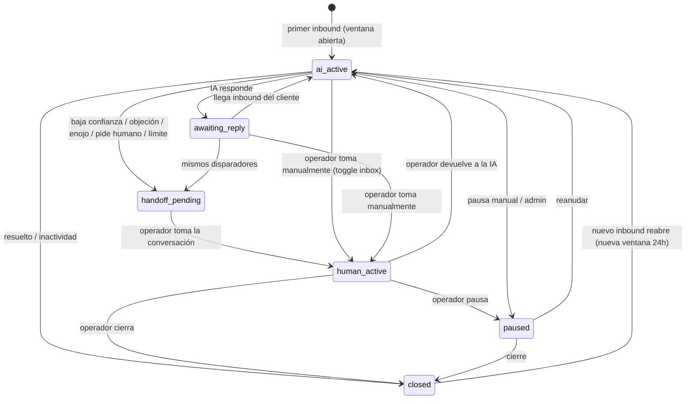

# BLUEPRINT — Plataforma de Inbox Conversacional WhatsApp con IA (Core v1)

> **Proyecto:** 01 — Agente de WhatsApp · **Generado con:** Forge (La Herrería · Skill #10) · **Fecha:** 2026-06-08
> **Inputs:** `../BRIEF.md` (producto + 17 módulos + lista maestra) · `../ARQUITECTURA-OBJETIVO.md` (runtime + data model + capa Tool)
> **Investigación:** repos ATS (Next.js+Supabase WhatsApp/Meta) y Movinsa (referencia de shapes/gotchas reales de YCloud — NO tenant) + docs oficiales YCloud / OpenRouter / HighLevel.

---

## 1. Resumen Ejecutivo

Plataforma **multi-tenant por workspace** de inbox conversacional para WhatsApp con IA operable por humano
(**no "solo un bot"**): inbox tipo WhatsApp Web + motor de agente con **buffer inteligente** + **handoff humano**

- CRM básico + custom prompting + tools activables + modo setter + agendamiento + **cumplimiento estricto de la
  ventana 24h / templates Meta** como guardrail duro.

**Stack (Golden Path):** Next.js + Tailwind + shadcn/ui + Supabase (Postgres + RLS + Realtime + pgvector).
**Estrategia de construcción:** MVP del camino feliz primero (webhook YCloud → normalizar → OpenRouter → responder
texto → persistir + inbox realtime con toggle IA/humano), luego capas (buffer → state machine + handoff → ventana 24h

- templates → HighLevel → setter).

## 2. Alcance y Decisiones Fijas

**Alcance de este Blueprint:** solo **Core v1** de la lista maestra del BRIEF. `v1.5` y `v2` quedan anotadas como fases futuras (ver §7).

| Tema                   | Decisión (fija — no re-discutir)                                                 |
| ---------------------- | -------------------------------------------------------------------------------- |
| Proveedor WhatsApp     | **YCloud** (único — sin Meta directo ni Kapso)                                   |
| LLM                    | **OpenRouter** (gateway; modelo por workspace/tarea, fallback, límites de costo) |
| Integración oficial v1 | **HighLevel** (only)                                                             |
| Stack                  | Next.js + Tailwind + shadcn + **Supabase**                                       |
| Multi-tenancy          | Por **workspace** (multi-tenant desde el diseño)                                 |
| Referencia YCloud      | Repo **Movinsa** (shapes/gotchas reales de YCloud — NO tenant del producto)      |

---

## 3. Esquema de Base de Datos (Supabase)

> **Origen y adaptación.** Este esquema reescribe el modelo maduro del ATS
> (`/Users/carlosdominguez/Developer/software/ATS/supabase/migrations/`) para el
> Core v1 de la plataforma de inbox conversacional. Se conservan los patrones
> probados (multi-tenancy con función helper de RLS, dedupe de inbound por
> `wamid` vía índice único parcial, Storage privado por tenant, `updated_at`
> trigger) y se generaliza el modelo: `organizations → workspaces`,
> `communications + whatsapp_orphan_messages → conversations + messages` (modelo
> de inbox conversacional, no log unificado de candidatos), y se incorporan las
> piezas nuevas del runtime objetivo (buffer/debounce, state machine, prompts
> versionados, tools, KB con pgvector, setter, integraciones OpenRouter/HighLevel).

### 3.1. Diferencias clave vs. ATS (Meta → YCloud)

| Tema               | ATS (Meta Cloud API)                          | Esta plataforma (YCloud)                              | Impacto en schema                                                                                                        |
| ------------------ | --------------------------------------------- | ----------------------------------------------------- | ------------------------------------------------------------------------------------------------------------------------ |
| ID de mensaje      | `external_id` = Meta message ID               | `wamid` (YCloud reenvía el mismo `wamid` de WhatsApp) | **`wamid` sigue válido.** Renombramos `external_id → wamid` y mantenemos el índice único parcial para dedupe de webhooks |
| Idioma de template | `es_MX` / `es_PA`                             | `"es"` (YCloud rechaza `es_PA`)                       | `language` default `'es'`; validación a nivel de app                                                                     |
| Credenciales       | `access_token` (Bearer)                       | API key YCloud + webhook signing secret               | Columnas `credentials JSONB` marcadas como **cifradas** (pgcrypto)                                                       |
| Inbound shape      | `entry[].changes[].value.messages[]`          | `body.whatsappInboundMessage`                         | Solo afecta normalizador (app), no schema; el evento normalizado es agnóstico                                            |
| Tenant             | `org_id → organizations`                      | `workspace_id → workspaces`                           | Renombre transversal                                                                                                     |
| Modelo de chat     | `communications` (1 tabla, candidate-centric) | `conversations` + `messages` (inbox-centric)          | Rediseño: se añade state machine, ventana 24h, toggle IA, buffer                                                         |
| Huérfanos          | `whatsapp_orphan_messages`                    | No aplica                                             | En un inbox todo contacto es de primera clase; se elimina el concepto orphan                                             |

### 3.2. Extensiones, enums y helpers

```sql
-- ============================================
-- Extensiones
-- ============================================
CREATE EXTENSION IF NOT EXISTS pgcrypto;   -- gen_random_uuid() + cifrado de secrets
CREATE EXTENSION IF NOT EXISTS vector;     -- pgvector: embeddings de la KB
CREATE EXTENSION IF NOT EXISTS pg_trgm;    -- búsqueda fuzzy (nombre/teléfono)

-- ============================================
-- Función: updated_at trigger (portado de ATS)
-- ============================================
CREATE OR REPLACE FUNCTION update_updated_at()
RETURNS TRIGGER AS $$
BEGIN
  NEW.updated_at = NOW();
  RETURN NEW;
END;
$$ LANGUAGE plpgsql;

-- ============================================
-- Enums Postgres (estados canónicos)
-- ============================================

-- State machine transversal de la conversación (Módulo 3)
CREATE TYPE conversation_state AS ENUM (
  'ai_active',          -- IA respondiendo
  'human_active',       -- agente humano al control
  'handoff_pending',    -- handoff solicitado, sin agente aún
  'waiting_reply',      -- esperando respuesta del contacto
  'paused',             -- conversación pausada
  'closed'              -- cerrada
);

CREATE TYPE conversation_channel AS ENUM ('whatsapp');  -- v1: solo WhatsApp/YCloud

CREATE TYPE message_direction AS ENUM ('in', 'out');

CREATE TYPE message_type AS ENUM (
  'text', 'audio', 'image', 'document', 'video', 'sticker', 'location', 'template', 'system'
);

-- Estado de entrega (YCloud reenvía estos status de WhatsApp)
CREATE TYPE message_status AS ENUM ('queued', 'sent', 'delivered', 'read', 'failed');

-- Buffer inteligente por silencio (Módulo 2)
CREATE TYPE batch_status AS ENUM ('buffering', 'flushed', 'processed', 'cancelled');

-- Estado Meta de templates (Módulo 10) — guardrail duro
CREATE TYPE template_status AS ENUM ('draft', 'submitted', 'approved', 'rejected', 'paused');

-- Versionado de prompts (Módulo 6)
CREATE TYPE prompt_version_state AS ENUM ('draft', 'published');

-- Resolución jerárquica del prompt activo (global > número > campaña > segmento > modo)
CREATE TYPE prompt_scope AS ENUM ('global', 'number', 'campaign', 'segment', 'mode');

-- Roles (Módulo 16)
CREATE TYPE workspace_role AS ENUM ('admin', 'manager', 'agent', 'viewer');

-- CRM (Módulo 4)
CREATE TYPE contact_stage AS ENUM ('new', 'engaged', 'qualified', 'customer', 'lost');

-- Integraciones (Módulos 11 y 13)
CREATE TYPE integration_provider AS ENUM ('highlevel', 'openrouter', 'ycloud', 'caldotcom');
```

> **Helper de RLS multi-tenant.** Se crea una sola vez tras `workspaces` y
> `memberships` (ver 3.3). Es el corazón del aislamiento por tenant: traduce el
> `auth.uid()` de Supabase al conjunto de `workspace_id` a los que pertenece el
> usuario. Reemplaza el `get_user_org_id()` single-org del ATS por uno
> multi-membership.

```sql
-- Devuelve los workspaces a los que pertenece el usuario autenticado
CREATE OR REPLACE FUNCTION auth_workspace_ids()
RETURNS SETOF UUID
LANGUAGE sql STABLE SECURITY DEFINER AS $$
  SELECT m.workspace_id
  FROM memberships m
  WHERE m.user_id = auth.uid() AND m.is_active = TRUE;
$$;

-- Verifica rol del usuario dentro de un workspace concreto
CREATE OR REPLACE FUNCTION auth_has_role(p_workspace UUID, p_roles workspace_role[])
RETURNS BOOLEAN
LANGUAGE sql STABLE SECURITY DEFINER AS $$
  SELECT EXISTS (
    SELECT 1 FROM memberships m
    WHERE m.user_id = auth.uid()
      AND m.workspace_id = p_workspace
      AND m.is_active = TRUE
      AND m.role = ANY(p_roles)
  );
$$;
```

### 3.3. Tenancy, usuarios y permisos

```sql
-- ============================================
-- workspaces (tenant raíz)
-- ============================================
CREATE TABLE workspaces (
  id UUID PRIMARY KEY DEFAULT gen_random_uuid(),
  name TEXT NOT NULL,
  slug TEXT UNIQUE NOT NULL,
  logo_url TEXT,
  settings JSONB DEFAULT '{
    "timezone": "America/Mexico_City",
    "language": "es"
  }'::jsonb NOT NULL,
  is_active BOOLEAN DEFAULT TRUE NOT NULL,
  created_at TIMESTAMPTZ DEFAULT NOW() NOT NULL,
  updated_at TIMESTAMPTZ DEFAULT NOW() NOT NULL
);
CREATE INDEX idx_workspaces_slug ON workspaces(slug);

-- ============================================
-- users (perfil ligado a auth.users de Supabase)
-- ============================================
CREATE TABLE users (
  id UUID PRIMARY KEY REFERENCES auth.users(id) ON DELETE CASCADE,
  full_name TEXT NOT NULL,
  email TEXT NOT NULL,
  avatar_url TEXT,
  is_active BOOLEAN DEFAULT TRUE NOT NULL,
  created_at TIMESTAMPTZ DEFAULT NOW() NOT NULL,
  updated_at TIMESTAMPTZ DEFAULT NOW() NOT NULL
);

-- ============================================
-- memberships (user ↔ workspace + rol) — N:M
-- ============================================
CREATE TABLE memberships (
  id UUID PRIMARY KEY DEFAULT gen_random_uuid(),
  workspace_id UUID NOT NULL REFERENCES workspaces(id) ON DELETE CASCADE,
  user_id UUID NOT NULL REFERENCES users(id) ON DELETE CASCADE,
  role workspace_role NOT NULL DEFAULT 'agent',
  is_active BOOLEAN DEFAULT TRUE NOT NULL,
  created_at TIMESTAMPTZ DEFAULT NOW() NOT NULL,
  updated_at TIMESTAMPTZ DEFAULT NOW() NOT NULL,
  UNIQUE (workspace_id, user_id)
);
CREATE INDEX idx_memberships_workspace ON memberships(workspace_id, is_active);
CREATE INDEX idx_memberships_user ON memberships(user_id, is_active);

-- ============================================
-- permissions (overrides finos opcionales sobre el rol)
-- v1: el rol cubre el 95%; esta tabla habilita capabilities puntuales
-- (ej: un 'agent' al que se le permite gestionar templates)
-- ============================================
CREATE TABLE permissions (
  id UUID PRIMARY KEY DEFAULT gen_random_uuid(),
  workspace_id UUID NOT NULL REFERENCES workspaces(id) ON DELETE CASCADE,
  user_id UUID NOT NULL REFERENCES users(id) ON DELETE CASCADE,
  capability TEXT NOT NULL,          -- ej: 'templates.manage', 'tools.configure'
  granted BOOLEAN DEFAULT TRUE NOT NULL,
  created_at TIMESTAMPTZ DEFAULT NOW() NOT NULL,
  UNIQUE (workspace_id, user_id, capability)
);
CREATE INDEX idx_permissions_lookup ON permissions(workspace_id, user_id);
```

### 3.4. CRM: contacts

> Adaptado del candidate-matching del ATS (`phone_e164` normalizado + índice
> `(org_id, phone_e164)`). Aquí el contacto es de primera clase y se deduplica
> por `(workspace_id, phone)`. `hl_contact_id` enlaza con HighLevel (Módulo 13).

```sql
CREATE TABLE contacts (
  id UUID PRIMARY KEY DEFAULT gen_random_uuid(),
  workspace_id UUID NOT NULL REFERENCES workspaces(id) ON DELETE CASCADE,
  phone TEXT NOT NULL,                       -- E.164 normalizado (a veces YCloud manda sin '+')
  name TEXT,
  email TEXT,
  source TEXT,                               -- de dónde llegó (campaña, orgánico, etc.)
  owner_id UUID REFERENCES users(id) ON DELETE SET NULL,
  stage contact_stage DEFAULT 'new' NOT NULL,
  tags TEXT[] DEFAULT '{}'::text[] NOT NULL,
  custom_fields JSONB DEFAULT '{}'::jsonb NOT NULL,
  opt_in BOOLEAN DEFAULT FALSE NOT NULL,     -- consentimiento WhatsApp
  opt_in_at TIMESTAMPTZ,
  hl_contact_id TEXT,                        -- ID en HighLevel (sync bidireccional)
  created_at TIMESTAMPTZ DEFAULT NOW() NOT NULL,
  updated_at TIMESTAMPTZ DEFAULT NOW() NOT NULL,
  CONSTRAINT uq_contacts_workspace_phone UNIQUE (workspace_id, phone)  -- dedupe por tel
);

CREATE INDEX idx_contacts_workspace        ON contacts(workspace_id);
CREATE INDEX idx_contacts_owner            ON contacts(workspace_id, owner_id);
CREATE INDEX idx_contacts_stage            ON contacts(workspace_id, stage);
CREATE INDEX idx_contacts_hl               ON contacts(workspace_id, hl_contact_id) WHERE hl_contact_id IS NOT NULL;
CREATE INDEX idx_contacts_tags_gin         ON contacts USING GIN (tags);
CREATE INDEX idx_contacts_custom_fields_gin ON contacts USING GIN (custom_fields jsonb_path_ops);
CREATE INDEX idx_contacts_name_trgm        ON contacts USING GIN (name gin_trgm_ops);

CREATE TRIGGER trg_contacts_updated_at
  BEFORE UPDATE ON contacts FOR EACH ROW EXECUTE FUNCTION update_updated_at();
```

### 3.5. Conversaciones, mensajes y buffer

```sql
-- ============================================
-- conversations (state machine + ventana 24h + toggle IA)
-- ============================================
CREATE TABLE conversations (
  id UUID PRIMARY KEY DEFAULT gen_random_uuid(),
  workspace_id UUID NOT NULL REFERENCES workspaces(id) ON DELETE CASCADE,
  contact_id UUID NOT NULL REFERENCES contacts(id) ON DELETE CASCADE,
  channel conversation_channel DEFAULT 'whatsapp' NOT NULL,
  state conversation_state DEFAULT 'ai_active' NOT NULL,
  ai_enabled BOOLEAN DEFAULT TRUE NOT NULL,        -- toggle IA/humano por conversación
  assigned_to UUID REFERENCES users(id) ON DELETE SET NULL,
  last_message_at TIMESTAMPTZ,
  -- Ventana 24h (Módulo 10, guardrail duro): último inbound + 24h.
  -- Si NOW() > window_expires_at → bloqueo de free text, obliga template aprobado.
  window_expires_at TIMESTAMPTZ,
  unread_count INT DEFAULT 0 NOT NULL,
  created_at TIMESTAMPTZ DEFAULT NOW() NOT NULL,
  updated_at TIMESTAMPTZ DEFAULT NOW() NOT NULL,
  CONSTRAINT uq_conversations_contact UNIQUE (workspace_id, contact_id, channel)
);

CREATE INDEX idx_conversations_workspace   ON conversations(workspace_id);
CREATE INDEX idx_conversations_inbox       ON conversations(workspace_id, last_message_at DESC);
CREATE INDEX idx_conversations_state       ON conversations(workspace_id, state);
CREATE INDEX idx_conversations_assigned    ON conversations(workspace_id, assigned_to);

CREATE TRIGGER trg_conversations_updated_at
  BEFORE UPDATE ON conversations FOR EACH ROW EXECUTE FUNCTION update_updated_at();

-- ============================================
-- message_batches (Buffer inteligente — Módulo 2)
-- Agrupa por SILENCIO del usuario. Se reinicia al llegar un nuevo msg inbound.
-- ============================================
CREATE TABLE message_batches (
  id UUID PRIMARY KEY DEFAULT gen_random_uuid(),
  workspace_id UUID NOT NULL REFERENCES workspaces(id) ON DELETE CASCADE,
  conversation_id UUID NOT NULL REFERENCES conversations(id) ON DELETE CASCADE,
  status batch_status DEFAULT 'buffering' NOT NULL,
  silence_ms INT NOT NULL DEFAULT 30000,           -- ventana de silencio (10-60s configurable)
  flush_at TIMESTAMPTZ,                             -- cuándo se cierra el buffer si no llega otro msg
  message_count INT DEFAULT 0 NOT NULL,
  merged_text TEXT,                                -- texto + audio transcrito + captions concatenados
  meta JSONB DEFAULT '{}'::jsonb NOT NULL,         -- reglas por tipo, bypass urgentes, logs de batch
  created_at TIMESTAMPTZ DEFAULT NOW() NOT NULL,
  updated_at TIMESTAMPTZ DEFAULT NOW() NOT NULL
);
CREATE INDEX idx_batches_conversation ON message_batches(conversation_id, status);
CREATE INDEX idx_batches_flush        ON message_batches(status, flush_at) WHERE status = 'buffering';

CREATE TRIGGER trg_batches_updated_at
  BEFORE UPDATE ON message_batches FOR EACH ROW EXECUTE FUNCTION update_updated_at();

-- ============================================
-- messages (in/out, media, wamid, batch)
-- ============================================
CREATE TABLE messages (
  id UUID PRIMARY KEY DEFAULT gen_random_uuid(),
  workspace_id UUID NOT NULL REFERENCES workspaces(id) ON DELETE CASCADE,
  conversation_id UUID NOT NULL REFERENCES conversations(id) ON DELETE CASCADE,
  direction message_direction NOT NULL,
  type message_type NOT NULL DEFAULT 'text',
  body TEXT,
  media JSONB,                                      -- {storage_path, mime, ycloud_media_id, transcript, caption}
  wamid TEXT,                                       -- WhatsApp message ID (YCloud lo reenvía) — dedupe
  batch_id UUID REFERENCES message_batches(id) ON DELETE SET NULL,
  template_id UUID,                                -- FK a templates (out fuera de ventana 24h)
  status message_status,                          -- solo outbound: queued→sent→delivered→read|failed
  error_message TEXT,
  sender_user_id UUID REFERENCES users(id) ON DELETE SET NULL,  -- humano que envió (NULL = IA/inbound)
  meta JSONB DEFAULT '{}'::jsonb NOT NULL,         -- from_name, raw payload YCloud, etc.
  created_at TIMESTAMPTZ DEFAULT NOW() NOT NULL
);

-- Dedupe de webhooks: un wamid no se inserta dos veces (índice único parcial, patrón ATS)
CREATE UNIQUE INDEX uq_messages_wamid
  ON messages(workspace_id, wamid)
  WHERE wamid IS NOT NULL;

CREATE INDEX idx_messages_conversation ON messages(conversation_id, created_at DESC);
CREATE INDEX idx_messages_workspace    ON messages(workspace_id, created_at DESC);
CREATE INDEX idx_messages_batch        ON messages(batch_id) WHERE batch_id IS NOT NULL;
CREATE INDEX idx_messages_meta_gin     ON messages USING GIN (meta jsonb_path_ops);

-- FK diferida desde messages.template_id (templates se define en 3.7)
-- ALTER TABLE messages ADD CONSTRAINT fk_messages_template ... (ver 3.7)

-- Realtime para inbox en vivo (patrón ATS)
ALTER PUBLICATION supabase_realtime ADD TABLE messages;
ALTER PUBLICATION supabase_realtime ADD TABLE conversations;
ALTER TABLE messages REPLICA IDENTITY FULL;
ALTER TABLE conversations REPLICA IDENTITY FULL;
```

### 3.6. Business info, prompts y versionado

```sql
-- ============================================
-- business_info (Módulo 5: estructurado + texto libre)
-- ============================================
CREATE TABLE business_info (
  id UUID PRIMARY KEY DEFAULT gen_random_uuid(),
  workspace_id UUID NOT NULL REFERENCES workspaces(id) ON DELETE CASCADE,
  structured JSONB DEFAULT '{}'::jsonb NOT NULL,   -- horarios, servicios, precios, FAQs estructuradas
  free_text TEXT,                                  -- contexto libre del negocio
  updated_at TIMESTAMPTZ DEFAULT NOW() NOT NULL,
  UNIQUE (workspace_id)
);
CREATE INDEX idx_business_info_structured_gin ON business_info USING GIN (structured jsonb_path_ops);
CREATE TRIGGER trg_business_info_updated_at
  BEFORE UPDATE ON business_info FOR EACH ROW EXECUTE FUNCTION update_updated_at();

-- ============================================
-- prompts (Módulo 6) — contenedor por scope jerárquico
-- Resolución: global > number > campaign > segment > mode
-- ============================================
CREATE TABLE prompts (
  id UUID PRIMARY KEY DEFAULT gen_random_uuid(),
  workspace_id UUID NOT NULL REFERENCES workspaces(id) ON DELETE CASCADE,
  scope prompt_scope NOT NULL,
  scope_ref TEXT,                                  -- número/campaña/segmento/modo al que aplica (NULL = global)
  name TEXT NOT NULL,
  active_version_id UUID,                          -- apunta a la prompt_version publicada vigente
  created_at TIMESTAMPTZ DEFAULT NOW() NOT NULL,
  updated_at TIMESTAMPTZ DEFAULT NOW() NOT NULL,
  UNIQUE (workspace_id, scope, scope_ref)
);
CREATE INDEX idx_prompts_workspace_scope ON prompts(workspace_id, scope, scope_ref);

-- ============================================
-- prompt_versions (draft/published + variables)
-- ============================================
CREATE TABLE prompt_versions (
  id UUID PRIMARY KEY DEFAULT gen_random_uuid(),
  workspace_id UUID NOT NULL REFERENCES workspaces(id) ON DELETE CASCADE,
  prompt_id UUID NOT NULL REFERENCES prompts(id) ON DELETE CASCADE,
  version INT NOT NULL,
  state prompt_version_state DEFAULT 'draft' NOT NULL,
  body TEXT NOT NULL,                              -- template del prompt con {{variables}}
  variables JSONB DEFAULT '[]'::jsonb NOT NULL,    -- [{name, source, default}]
  model_overrides JSONB DEFAULT '{}'::jsonb NOT NULL, -- modelo/temp por este prompt
  guardrails JSONB DEFAULT '{}'::jsonb NOT NULL,   -- límites, abstención, fallback
  created_by UUID REFERENCES users(id) ON DELETE SET NULL,
  published_at TIMESTAMPTZ,
  created_at TIMESTAMPTZ DEFAULT NOW() NOT NULL,
  UNIQUE (prompt_id, version)
);
CREATE INDEX idx_prompt_versions_prompt ON prompt_versions(prompt_id, state);

ALTER TABLE prompts
  ADD CONSTRAINT fk_prompts_active_version
  FOREIGN KEY (active_version_id) REFERENCES prompt_versions(id) ON DELETE SET NULL;

CREATE TRIGGER trg_prompts_updated_at
  BEFORE UPDATE ON prompts FOR EACH ROW EXECUTE FUNCTION update_updated_at();
```

### 3.7. Templates Meta (guardrail duro)

> Adaptado de `whatsapp_templates` del ATS. Cambios: `org_id → workspace_id`,
> `language` default `'es'` (YCloud rechaza `es_PA`), `meta_status` →
> enum `template_status` con `draft/submitted/approved/rejected/paused`, y
> `components JSONB` para header/body/buttons (estructura compatible con el
> payload plano de YCloud `POST /v2/whatsapp/messages`).

```sql
CREATE TABLE templates (
  id UUID PRIMARY KEY DEFAULT gen_random_uuid(),
  workspace_id UUID NOT NULL REFERENCES workspaces(id) ON DELETE CASCADE,
  name TEXT NOT NULL,
  language TEXT NOT NULL DEFAULT 'es',             -- "es", NO "es_PA" (gotcha YCloud)
  category TEXT NOT NULL CHECK (category IN ('marketing', 'utility', 'authentication')),
  status template_status NOT NULL DEFAULT 'draft',
  body_template TEXT NOT NULL,
  components JSONB DEFAULT '{}'::jsonb NOT NULL,   -- {header, body_params, buttons, footer}
  variables JSONB DEFAULT '[]'::jsonb NOT NULL,    -- posicionales {{1}}, {{2}}...
  provider_template_id TEXT,                       -- ID en YCloud/Meta
  rejection_reason TEXT,
  created_at TIMESTAMPTZ DEFAULT NOW() NOT NULL,
  updated_at TIMESTAMPTZ DEFAULT NOW() NOT NULL,
  UNIQUE (workspace_id, name, language)
);
CREATE INDEX idx_templates_workspace_status ON templates(workspace_id, status);
CREATE INDEX idx_templates_components_gin    ON templates USING GIN (components jsonb_path_ops);

CREATE TRIGGER trg_templates_updated_at
  BEFORE UPDATE ON templates FOR EACH ROW EXECUTE FUNCTION update_updated_at();

-- FK diferida de messages.template_id (tabla messages ya existe)
ALTER TABLE messages
  ADD CONSTRAINT fk_messages_template
  FOREIGN KEY (template_id) REFERENCES templates(id) ON DELETE SET NULL;
```

### 3.8. Tools, integraciones y Knowledge Base

```sql
-- ============================================
-- tools (catálogo — Módulo 7). Define la interfaz; no es por workspace.
-- ============================================
CREATE TABLE tools (
  id UUID PRIMARY KEY DEFAULT gen_random_uuid(),
  key TEXT UNIQUE NOT NULL,                        -- 'highlevel', 'openrouter', 'ycloud'
  name TEXT NOT NULL,
  description TEXT,
  schema JSONB DEFAULT '{}'::jsonb NOT NULL,       -- JSON schema de args (derivado del ZodSchema)
  created_at TIMESTAMPTZ DEFAULT NOW() NOT NULL
);

-- ============================================
-- tool_configs (activación + credenciales por workspace)
-- ============================================
CREATE TABLE tool_configs (
  id UUID PRIMARY KEY DEFAULT gen_random_uuid(),
  workspace_id UUID NOT NULL REFERENCES workspaces(id) ON DELETE CASCADE,
  tool_id UUID NOT NULL REFERENCES tools(id) ON DELETE CASCADE,
  enabled BOOLEAN DEFAULT FALSE NOT NULL,
  -- 🔒 CIFRADO: credenciales sensibles (API keys, webhooks n8n con tokens).
  -- Cifrar con pgcrypto (pgp_sym_encrypt) usando clave de servidor; NUNCA exponer al cliente.
  credentials JSONB DEFAULT '{}'::jsonb NOT NULL,
  config JSONB DEFAULT '{}'::jsonb NOT NULL,       -- timeout/retry/fallback, confirmación previa
  created_at TIMESTAMPTZ DEFAULT NOW() NOT NULL,
  updated_at TIMESTAMPTZ DEFAULT NOW() NOT NULL,
  UNIQUE (workspace_id, tool_id)
);
CREATE INDEX idx_tool_configs_workspace ON tool_configs(workspace_id, enabled);
CREATE TRIGGER trg_tool_configs_updated_at
  BEFORE UPDATE ON tool_configs FOR EACH ROW EXECUTE FUNCTION update_updated_at();

-- ============================================
-- integrations (HighLevel, OpenRouter, YCloud — Módulos 11/13)
-- ============================================
CREATE TABLE integrations (
  id UUID PRIMARY KEY DEFAULT gen_random_uuid(),
  workspace_id UUID NOT NULL REFERENCES workspaces(id) ON DELETE CASCADE,
  provider integration_provider NOT NULL,
  enabled BOOLEAN DEFAULT FALSE NOT NULL,
  -- 🔒 CIFRADO: API keys + OAuth tokens (access/refresh) cifrados con pgcrypto.
  credentials JSONB DEFAULT '{}'::jsonb NOT NULL,  -- {api_key} | {ycloud_api_key, webhook_signing_secret}
  oauth_tokens JSONB DEFAULT '{}'::jsonb NOT NULL, -- {access_token, refresh_token, expires_at} (HighLevel)
  config JSONB DEFAULT '{}'::jsonb NOT NULL,       -- mapeo de campos, modelo por tarea, límites de costo
  created_at TIMESTAMPTZ DEFAULT NOW() NOT NULL,
  updated_at TIMESTAMPTZ DEFAULT NOW() NOT NULL,
  UNIQUE (workspace_id, provider)
);
CREATE INDEX idx_integrations_workspace ON integrations(workspace_id, provider);
CREATE TRIGGER trg_integrations_updated_at
  BEFORE UPDATE ON integrations FOR EACH ROW EXECUTE FUNCTION update_updated_at();

-- ============================================
-- kb_documents + kb_chunks (Módulo 12: pgvector)
-- ============================================
CREATE TABLE kb_documents (
  id UUID PRIMARY KEY DEFAULT gen_random_uuid(),
  workspace_id UUID NOT NULL REFERENCES workspaces(id) ON DELETE CASCADE,
  title TEXT NOT NULL,
  source_type TEXT NOT NULL DEFAULT 'doc' CHECK (source_type IN ('doc', 'faq', 'url', 'snippet')),
  source_url TEXT,
  content TEXT,
  meta JSONB DEFAULT '{}'::jsonb NOT NULL,
  created_at TIMESTAMPTZ DEFAULT NOW() NOT NULL,
  updated_at TIMESTAMPTZ DEFAULT NOW() NOT NULL
);
CREATE INDEX idx_kb_documents_workspace ON kb_documents(workspace_id);
CREATE TRIGGER trg_kb_documents_updated_at
  BEFORE UPDATE ON kb_documents FOR EACH ROW EXECUTE FUNCTION update_updated_at();

CREATE TABLE kb_chunks (
  id UUID PRIMARY KEY DEFAULT gen_random_uuid(),
  workspace_id UUID NOT NULL REFERENCES workspaces(id) ON DELETE CASCADE,
  document_id UUID NOT NULL REFERENCES kb_documents(id) ON DELETE CASCADE,
  chunk_index INT NOT NULL,
  content TEXT NOT NULL,
  embedding vector(1536),                          -- dim según modelo de embeddings (OpenRouter)
  meta JSONB DEFAULT '{}'::jsonb NOT NULL,
  created_at TIMESTAMPTZ DEFAULT NOW() NOT NULL,
  UNIQUE (document_id, chunk_index)
);
CREATE INDEX idx_kb_chunks_workspace ON kb_chunks(workspace_id);
CREATE INDEX idx_kb_chunks_document  ON kb_chunks(document_id);

-- Índice ANN para búsqueda semántica. HNSW (mejor recall/latencia que ivfflat,
-- no requiere training). Alternativa ivfflat comentada para datasets grandes.
CREATE INDEX idx_kb_chunks_embedding_hnsw
  ON kb_chunks USING hnsw (embedding vector_cosine_ops);
-- CREATE INDEX idx_kb_chunks_embedding_ivfflat
--   ON kb_chunks USING ivfflat (embedding vector_cosine_ops) WITH (lists = 100);
```

### 3.9. Setter, agendamiento y observabilidad

```sql
-- ============================================
-- setter_configs (Módulo 8: knockout + score)
-- ============================================
CREATE TABLE setter_configs (
  id UUID PRIMARY KEY DEFAULT gen_random_uuid(),
  workspace_id UUID NOT NULL REFERENCES workspaces(id) ON DELETE CASCADE,
  name TEXT NOT NULL,
  enabled BOOLEAN DEFAULT FALSE NOT NULL,
  questions JSONB DEFAULT '[]'::jsonb NOT NULL,    -- [{id, text, type, weight}]
  knockout_rules JSONB DEFAULT '[]'::jsonb NOT NULL, -- [{question_id, condition, action}]
  scoring JSONB DEFAULT '{}'::jsonb NOT NULL,      -- pesos, umbral de calificación
  post_action JSONB DEFAULT '{}'::jsonb NOT NULL,  -- qué hacer al calificar (tag, handoff, agendar)
  created_at TIMESTAMPTZ DEFAULT NOW() NOT NULL,
  updated_at TIMESTAMPTZ DEFAULT NOW() NOT NULL,
  UNIQUE (workspace_id, name)
);
CREATE INDEX idx_setter_configs_workspace ON setter_configs(workspace_id, enabled);
CREATE TRIGGER trg_setter_configs_updated_at
  BEFORE UPDATE ON setter_configs FOR EACH ROW EXECUTE FUNCTION update_updated_at();

-- ============================================
-- schedules (config de agendamiento — Módulo 9)
-- ============================================
CREATE TABLE schedules (
  id UUID PRIMARY KEY DEFAULT gen_random_uuid(),
  workspace_id UUID NOT NULL REFERENCES workspaces(id) ON DELETE CASCADE,
  name TEXT NOT NULL,
  mode TEXT NOT NULL DEFAULT 'external_link' CHECK (mode IN ('external_link', 'highlevel')),
  config JSONB DEFAULT '{}'::jsonb NOT NULL,       -- {link} | {calendar_id, timezone}
  enabled BOOLEAN DEFAULT TRUE NOT NULL,
  created_at TIMESTAMPTZ DEFAULT NOW() NOT NULL,
  updated_at TIMESTAMPTZ DEFAULT NOW() NOT NULL
);
CREATE INDEX idx_schedules_workspace ON schedules(workspace_id, enabled);
CREATE TRIGGER trg_schedules_updated_at
  BEFORE UPDATE ON schedules FOR EACH ROW EXECUTE FUNCTION update_updated_at();

-- ============================================
-- appointments (citas creadas)
-- ============================================
CREATE TABLE appointments (
  id UUID PRIMARY KEY DEFAULT gen_random_uuid(),
  workspace_id UUID NOT NULL REFERENCES workspaces(id) ON DELETE CASCADE,
  contact_id UUID REFERENCES contacts(id) ON DELETE SET NULL,
  conversation_id UUID REFERENCES conversations(id) ON DELETE SET NULL,
  schedule_id UUID REFERENCES schedules(id) ON DELETE SET NULL,
  scheduled_at TIMESTAMPTZ NOT NULL,
  status TEXT NOT NULL DEFAULT 'booked' CHECK (status IN ('booked', 'confirmed', 'cancelled', 'completed', 'no_show')),
  hl_appointment_id TEXT,                          -- ID en HighLevel
  meta JSONB DEFAULT '{}'::jsonb NOT NULL,
  created_at TIMESTAMPTZ DEFAULT NOW() NOT NULL,
  updated_at TIMESTAMPTZ DEFAULT NOW() NOT NULL
);
CREATE INDEX idx_appointments_workspace ON appointments(workspace_id, scheduled_at);
CREATE INDEX idx_appointments_contact   ON appointments(contact_id);
CREATE TRIGGER trg_appointments_updated_at
  BEFORE UPDATE ON appointments FOR EACH ROW EXECUTE FUNCTION update_updated_at();

-- ============================================
-- events (logs / observabilidad — Módulo 17)
-- Captura tool calls, decisiones del motor, métricas de tokens/costo OpenRouter,
-- transiciones de state machine, errores de envío YCloud, flush de buffers.
-- ============================================
CREATE TABLE events (
  id UUID PRIMARY KEY DEFAULT gen_random_uuid(),
  workspace_id UUID NOT NULL REFERENCES workspaces(id) ON DELETE CASCADE,
  conversation_id UUID REFERENCES conversations(id) ON DELETE SET NULL,
  type TEXT NOT NULL,                              -- 'tool_call', 'decision', 'llm_usage', 'state_change', 'send_error'
  level TEXT NOT NULL DEFAULT 'info' CHECK (level IN ('debug', 'info', 'warn', 'error')),
  payload JSONB DEFAULT '{}'::jsonb NOT NULL,      -- args, resultado, tokens, costo_usd, latency_ms
  created_at TIMESTAMPTZ DEFAULT NOW() NOT NULL
);
CREATE INDEX idx_events_workspace    ON events(workspace_id, created_at DESC);
CREATE INDEX idx_events_conversation ON events(conversation_id, created_at DESC);
CREATE INDEX idx_events_type         ON events(workspace_id, type, created_at DESC);
CREATE INDEX idx_events_payload_gin  ON events USING GIN (payload jsonb_path_ops);
```

### 3.10. Estrategia RLS multi-tenant

**Modelo.** Todas las tablas tenant-scoped llevan `workspace_id` y RLS habilitado.
El aislamiento se resuelve con la función `auth_workspace_ids()` (3.2): un usuario
solo ve/escribe filas cuyo `workspace_id` esté entre sus memberships activas. Los
roles (`admin/manager/agent/viewer`) se verifican con `auth_has_role()` para
operaciones de gestión (settings, templates, tool credentials). El **service_role**
del webhook YCloud bypassa RLS (inserta inbound, actualiza status) — la app nunca
usa esa key en el cliente.

Patrón aplicado a **toda** tabla tenant-scoped:

```sql
ALTER TABLE <tabla> ENABLE ROW LEVEL SECURITY;
-- SELECT: cualquier miembro activo del workspace
-- INSERT/UPDATE/DELETE: miembros (o roles concretos según sensibilidad)
```

Tres políticas representativas:

```sql
-- ============================================
-- contacts: lectura para miembros, escritura para no-viewers
-- ============================================
ALTER TABLE contacts ENABLE ROW LEVEL SECURITY;

CREATE POLICY "ws members read contacts"
  ON contacts FOR SELECT
  USING (workspace_id IN (SELECT auth_workspace_ids()));

CREATE POLICY "ws operators write contacts"
  ON contacts FOR ALL
  USING (
    workspace_id IN (SELECT auth_workspace_ids())
    AND auth_has_role(workspace_id, ARRAY['admin','manager','agent']::workspace_role[])
  )
  WITH CHECK (
    workspace_id IN (SELECT auth_workspace_ids())
    AND auth_has_role(workspace_id, ARRAY['admin','manager','agent']::workspace_role[])
  );

-- ============================================
-- conversations: miembros leen; agentes operan; solo el asignado o manager+ reasigna
-- ============================================
ALTER TABLE conversations ENABLE ROW LEVEL SECURITY;

CREATE POLICY "ws members read conversations"
  ON conversations FOR SELECT
  USING (workspace_id IN (SELECT auth_workspace_ids()));

CREATE POLICY "ws agents update conversations"
  ON conversations FOR UPDATE
  USING (
    workspace_id IN (SELECT auth_workspace_ids())
    AND (
      auth_has_role(workspace_id, ARRAY['admin','manager']::workspace_role[])
      OR assigned_to = auth.uid()                 -- el agente asignado controla su conversación
    )
  )
  WITH CHECK (workspace_id IN (SELECT auth_workspace_ids()));

-- ============================================
-- messages: miembros leen los de sus workspaces; outbound humano lo inserta la app
-- (el inbound y status updates llegan vía service_role, que bypassa RLS)
-- ============================================
ALTER TABLE messages ENABLE ROW LEVEL SECURITY;

CREATE POLICY "ws members read messages"
  ON messages FOR SELECT
  USING (workspace_id IN (SELECT auth_workspace_ids()));

CREATE POLICY "ws agents send messages"
  ON messages FOR INSERT
  WITH CHECK (
    workspace_id IN (SELECT auth_workspace_ids())
    AND direction = 'out'
    AND auth_has_role(workspace_id, ARRAY['admin','manager','agent']::workspace_role[])
  );
```

> El resto de tablas tenant-scoped (`message_batches`, `business_info`,
> `prompts`, `prompt_versions`, `templates`, `tool_configs`, `integrations`,
> `kb_documents`, `kb_chunks`, `setter_configs`, `schedules`, `appointments`,
> `events`, `memberships`, `permissions`) siguen el mismo patrón. Las tablas con
> **credenciales** (`tool_configs`, `integrations`) restringen además `SELECT` de
> esas columnas a `admin/manager` (en la práctica las credenciales se leen solo
> server-side; el cliente nunca selecciona las columnas cifradas).

### 3.11. Columnas que guardan secretos (deben cifrarse)

> 🔒 Cifrar en reposo con **pgcrypto** (`pgp_sym_encrypt`/`pgp_sym_decrypt`) usando
> una clave de servidor (Supabase Vault o variable de entorno del backend).
> NUNCA exponer al cliente; cifrado/descifrado solo en server actions / edge functions.

| Tabla          | Columna        | Contenido sensible                                                              |
| -------------- | -------------- | ------------------------------------------------------------------------------- |
| `integrations` | `credentials`  | API key YCloud, `webhook_signing_secret`, OpenRouter API key, HighLevel API key |
| `integrations` | `oauth_tokens` | `access_token` / `refresh_token` OAuth de HighLevel                             |
| `tool_configs` | `credentials`  | API keys de tools, URLs de webhook externo del workspace con tokens embebidos   |

> **Auto-Blindaje (gotchas YCloud incorporados):** (1) `wamid` sigue siendo el
> identificador de dedupe — índice único parcial `(workspace_id, wamid)`. (2) El
> `phone` puede llegar sin `+`; la app normaliza a E.164 antes de escribir
> (`uq_contacts_workspace_phone` exige formato consistente). (3) `templates.language`
> default `'es'` — nunca `'es_PA'`.

---

## 4. Motor del Agente (Runtime)

> El runtime es el corazón ejecutable de la fábrica. Recibe un evento de WhatsApp vía YCloud y, a través de 8 subsistemas con contratos TypeScript estrictos, decide y produce una respuesta. Cada subsistema es independiente, testeable y reemplazable. El flujo canónico es:
>
> ```
> YCloud → [1]Ingress+Normalizador → [2]Buffer/Debounce → [3]Motor de Decisión
>        → [4]Agent Runtime (OpenRouter) → [5]Capa de Tools → [6]Salida YCloud
>        → (persistencia + observabilidad Supabase)
> ```
>
> La **State Machine** (§4.7) y la **Ventana 24h** (§4.8) son transversales: cualquier subsistema puede consultarlas y son guardrails duros que ningún camino puede saltarse sin override explícito.

### Tipos base compartidos

```typescript
// src/features/runtime/types/core.ts
export type WorkspaceId = string; // uuid del tenant
export type E164 = string; // "+5219981234567" — SIEMPRE con + y código de país

export type InboundType =
  | "text"
  | "audio"
  | "image"
  | "video"
  | "document"
  | "sticker"
  | "interactive";

/** Evento unificado: la ÚNICA forma que el resto del runtime conoce. */
export interface UnifiedInboundEvent {
  workspace: WorkspaceId;
  from: E164; // cliente (normalizado)
  to: E164; // número de negocio
  type: InboundType;
  text?: string; // body de texto, caption, o transcripción de audio
  media?: {
    kind: "audio" | "image" | "video" | "document" | "sticker";
    link: string; // https://api.ycloud.com/v2/whatsapp/media/download/{id}?sig=...
    mimeType?: string;
    caption?: string;
    sha256?: string;
  };
  interactive?: {
    type: "button_reply" | "list_reply";
    id: string;
    title: string;
  };
  contactName?: string; // customerProfile.name
  ts: number; // epoch ms (de sendTime)
  wamid: string; // ID único del mensaje — clave de dedupe
  contextWamid?: string; // si responde a un mensaje previo (reply)
  raw: unknown; // payload YCloud original, para auditoría
}
```

---

### 4.1 Ingress + Normalizador

**Responsabilidad:** recibir el webhook HTTP de YCloud, verificar su autenticidad, deduplicar por `wamid`, y transformar el shape heterogéneo de YCloud en un `UnifiedInboundEvent`. Es la única frontera entre "el mundo YCloud" y "el mundo del runtime".

**Endpoint:** `POST /api/webhooks/ycloud/[workspace]` (App Router, Next.js — un path por workspace para resolver el tenant sin lookup).

#### 4.1.1 Verificación de firma (guardrail de seguridad)

YCloud firma con el header `YCloud-Signature: t={timestamp},s={signature}`. El firmado es **HMAC-SHA256 sobre `timestamp + "." + rawBody`** usando el secret del endpoint. Crítico: leer el **raw body** ANTES de parsear JSON (Next.js parsea por defecto; hay que desactivarlo).

```typescript
// src/features/runtime/services/webhook-security.ts
import crypto from "node:crypto";

const REPLAY_TOLERANCE_MS = 5 * 60 * 1000; // 5 min

export function verifyYCloudSignature(args: {
  rawBody: string;
  signatureHeader: string | null; // "t=1700000000,s=abc123..."
  secret: string;
}): { ok: true } | { ok: false; reason: string } {
  if (!args.signatureHeader) return { ok: false, reason: "missing_signature" };

  const parts = Object.fromEntries(
    args.signatureHeader
      .split(",")
      .map((kv) => kv.split("=").map((s) => s.trim()) as [string, string]),
  );
  const t = Number(parts.t);
  const sig = parts.s;
  if (!t || !sig) return { ok: false, reason: "malformed_signature" };

  // Anti-replay: rechazar timestamps fuera de tolerancia
  if (Math.abs(Date.now() - t * 1000) > REPLAY_TOLERANCE_MS) {
    return { ok: false, reason: "timestamp_out_of_tolerance" };
  }

  const expected = crypto
    .createHmac("sha256", args.secret)
    .update(`${t}.${args.rawBody}`)
    .digest("hex");

  // Comparación en tiempo constante
  const a = Buffer.from(sig);
  const b = Buffer.from(expected);
  if (a.length !== b.length || !crypto.timingSafeEqual(a, b)) {
    return { ok: false, reason: "signature_mismatch" };
  }
  return { ok: true };
}
```

#### 4.1.2 Dedupe por `wamid`

YCloud puede reintentar webhooks; además existe el riesgo de eco. El dedupe es a nivel de base de datos vía constraint único, no en memoria (multi-instancia en serverless).

```sql
-- migración: la tabla messages ya tiene wamid; el dedupe se apoya en un índice único parcial
CREATE UNIQUE INDEX uq_messages_wamid ON messages (workspace_id, wamid) WHERE wamid IS NOT NULL;
```

```typescript
// El INSERT del inbound usa ON CONFLICT DO NOTHING; si rowCount === 0 → ya procesado, ACK y salir.
export async function dedupeInsert(
  ev: UnifiedInboundEvent,
): Promise<{ isNew: boolean; messageId: string }>;
```

#### 4.1.3 Normalizador

Mapea el shape **real** de YCloud (`whatsappInboundMessage`) al evento unificado. Aplica las gotchas confirmadas en Movinsa: normalización de teléfono y resolución de media.

```typescript
// src/features/runtime/services/normalizer.ts
import { z } from "zod";

// Shape REAL del webhook inbound de YCloud (verificado en docs + Movinsa)
const YCloudInboundSchema = z.object({
  type: z.literal("whatsapp.inbound_message.received"),
  id: z.string(),
  createTime: z.string(),
  whatsappInboundMessage: z.object({
    id: z.string(),
    wamid: z.string(),
    wabaId: z.string().optional(),
    from: z.string(),
    to: z.string(),
    sendTime: z.string().optional(),
    customerProfile: z.object({ name: z.string().optional() }).optional(),
    type: z.string(),
    text: z.object({ body: z.string() }).optional(),
    image: z
      .object({
        link: z.string(),
        id: z.string().optional(),
        caption: z.string().optional(),
        mime_type: z.string().optional(),
        sha256: z.string().optional(),
      })
      .optional(),
    audio: z
      .object({
        link: z.string(),
        id: z.string().optional(),
        mime_type: z.string().optional(),
        sha256: z.string().optional(),
      })
      .optional(),
    video: z
      .object({
        link: z.string(),
        id: z.string().optional(),
        caption: z.string().optional(),
        mime_type: z.string().optional(),
      })
      .optional(),
    document: z
      .object({
        link: z.string(),
        id: z.string().optional(),
        filename: z.string().optional(),
        caption: z.string().optional(),
      })
      .optional(),
    sticker: z
      .object({ link: z.string(), id: z.string().optional() })
      .optional(),
    interactive: z.unknown().optional(),
    context: z.object({ from: z.string(), id: z.string() }).optional(),
  }),
});

/** Gotcha (producción): a veces el teléfono llega sin "+". Forzar E.164. */
export function normalizePhone(raw: string, defaultCountry = "52"): E164 {
  const digits = raw.replace(/[^\d+]/g, "");
  if (digits.startsWith("+")) return digits as E164;
  return `+${defaultCountry}${digits}` as E164;
}

export function normalizeInbound(
  payload: unknown,
  workspace: WorkspaceId,
): UnifiedInboundEvent {
  const p = YCloudInboundSchema.parse(payload);
  const m = p.whatsappInboundMessage;
  const mediaNode = m.image ?? m.audio ?? m.video ?? m.document ?? m.sticker;

  return {
    workspace,
    from: normalizePhone(m.from),
    to: normalizePhone(m.to),
    type: m.type as InboundType,
    text: m.text?.body ?? mediaNode?.["caption" as never],
    media: mediaNode
      ? {
          kind: m.type as never,
          link: mediaNode.link,
          mimeType: (mediaNode as { mime_type?: string }).mime_type,
          caption: (mediaNode as { caption?: string }).caption,
          sha256: (mediaNode as { sha256?: string }).sha256,
        }
      : undefined,
    contactName: m.customerProfile?.name,
    ts: m.sendTime ? Date.parse(m.sendTime) : Date.now(),
    wamid: m.wamid,
    contextWamid: m.context?.id,
    raw: payload,
  };
}
```

**Flujo completo del handler de ingress:**

```typescript
// src/app/api/webhooks/ycloud/[workspace]/route.ts
export async function POST(
  req: Request,
  { params }: { params: { workspace: string } },
) {
  const rawBody = await req.text(); // 1. raw body (sin parsear)
  const sig = verifyYCloudSignature({
    rawBody,
    signatureHeader: req.headers.get("YCloud-Signature"),
    secret: getSecret(params.workspace),
  });
  if (!sig.ok) return new Response("invalid signature", { status: 401 }); // 2. firma

  const payload = JSON.parse(rawBody);
  if (payload.type === "whatsapp.message.updated") {
    await handleStatusUpdate(payload);
    return Response.json({ ok: true });
  }
  if (payload.type !== "whatsapp.inbound_message.received")
    return Response.json({ ok: true }); // ignora otros eventos

  const ev = normalizeInbound(payload, params.workspace); // 3. normalizar
  const { isNew } = await dedupeInsert(ev); // 4. dedupe + persistir inbound
  if (!isNew) return Response.json({ ok: true }); // ya procesado → ACK

  // Si es audio → encolar transcripción; si no → directo al buffer
  await enqueueToBuffer(ev); // 5. al buffer (§4.2)
  return Response.json({ ok: true }); // ACK rápido (<5s, evita reintentos)
}
```

> **Regla de oro:** el webhook responde 2xx **siempre** que la firma sea válida, incluso si el procesamiento downstream falla. El trabajo pesado (transcripción, LLM, envío) ocurre fuera del ciclo de request para no provocar reintentos de YCloud.

---

### 4.2 Buffer / Debounce Inteligente — DIFERENCIADOR

Este es el subsistema que separa a un bot torpe de un agente que "escucha como humano". El usuario rara vez envía un pensamiento completo en un mensaje: manda "hola", luego "tengo una duda", luego "sobre mi cuota". Un bot ingenuo responde 3 veces. Nuestro agente **espera el silencio del usuario** y procesa el lote como un solo turno.

#### 4.2.1 Reglas de comportamiento

1. **Agrupa por SILENCIO, no por primer mensaje.** El timer arranca con el primer mensaje del lote y **se REINICIA con cada mensaje nuevo**. Solo dispara cuando han pasado `delay` segundos sin actividad.
2. **Delay configurable 10–60s** por workspace (default 12s).
3. **Junta texto + audio transcrito + captions** en un solo string consolidado, ordenado por timestamp.
4. **Reglas por tipo:** si el último mensaje del lote es **audio** (transcripción pendiente o en curso), extiende la ventana (`audioGraceMs`, default +8s) porque la transcripción tarda y el usuario suele seguir hablando.
5. **Bypass para urgentes/interactivos:** mensajes `interactive` (botón/lista) o marcados urgentes saltan el buffer y van directo a Decisión — un click es un turno completo e intencional.
6. **Logs de batch:** cada disparo registra `{batchId, messageCount, waitedMs, triggerReason, consolidatedLength}`.

#### 4.2.2 Contrato

```typescript
// src/features/runtime/types/buffer.ts
export interface BufferConfig {
  delayMs: number; // 10_000 – 60_000
  audioGraceMs: number; // extra si el último es audio (default 8_000)
  maxBatchMs: number; // techo absoluto: dispara aunque el usuario no calle (default 90_000)
  maxBatchSize: number; // techo de mensajes por lote (default 20)
}

export interface MessageBatch {
  id: string;
  workspaceId: WorkspaceId;
  contactPhone: E164;
  status: "open" | "ready" | "processing" | "done";
  firstMessageTs: number;
  lastMessageTs: number; // se actualiza con cada mensaje → base del cálculo de silencio
  fireAt: number; // lastMessageTs + delay efectivo → cuándo disparar
  messageIds: string[];
}

export interface ConsolidatedTurn {
  batchId: string;
  workspaceId: WorkspaceId;
  contactPhone: E164;
  text: string; // texto+transcripción+captions unidos por "\n"
  events: UnifiedInboundEvent[];
}
```

#### 4.2.3 Implementación CONCRETA en Supabase + Next.js (sin Redis)

El mecanismo central es una tabla `message_batches` que actúa como cola de debounce, y un **worker disparado por `pg_cron`** (extensión nativa de Supabase) que cada pocos segundos busca batches cuyo silencio ya venció.

**Mecanismo de disparo por silencio (el corazón):**

```
Mensaje entra → UPSERT en message_batches (un batch "open" por contacto)
             → lastMessageTs = now;  fireAt = now + delayMs (REINICIA el timer)
             → messageIds = append

pg_cron cada 5s → SELECT batches WHERE status='open' AND fireAt <= now()
                → marca status='ready' (lock atómico con FOR UPDATE SKIP LOCKED)
                → invoca Edge Function que consolida y empuja a Decisión
```

El "reinicio del timer" es simplemente **reescribir `fireAt` en cada UPSERT**. No hay timers en memoria (que no sobreviven a serverless): el estado de tiempo vive en Postgres y un cron lo evalúa. Esto es robusto ante reinicios, multi-instancia y cold starts.

```sql
-- Upsert de mensaje al batch (reinicia el timer)
CREATE OR REPLACE FUNCTION buffer_append(
  p_workspace uuid, p_phone text, p_message_id uuid, p_ts bigint,
  p_delay_ms int, p_is_audio bool, p_audio_grace_ms int, p_max_batch_ms int
) RETURNS uuid LANGUAGE plpgsql AS $$
DECLARE v_batch_id uuid; v_first bigint; v_fire bigint;
BEGIN
  SELECT id, first_message_ts INTO v_batch_id, v_first
  FROM message_batches
  WHERE workspace_id = p_workspace AND contact_phone = p_phone AND status = 'open'
  FOR UPDATE;

  IF v_batch_id IS NULL THEN
    INSERT INTO message_batches (workspace_id, contact_phone, status, first_message_ts, last_message_ts, fire_at, message_ids)
    VALUES (p_workspace, p_phone, 'open', p_ts, p_ts,
            p_ts + p_delay_ms + (CASE WHEN p_is_audio THEN p_audio_grace_ms ELSE 0 END),
            ARRAY[p_message_id])
    RETURNING id INTO v_batch_id;
  ELSE
    -- techo absoluto: fire_at nunca pasa de first + max_batch_ms
    v_fire := LEAST(p_ts + p_delay_ms + (CASE WHEN p_is_audio THEN p_audio_grace_ms ELSE 0 END),
                    v_first + p_max_batch_ms);
    UPDATE message_batches
    SET last_message_ts = p_ts, fire_at = v_fire, message_ids = array_append(message_ids, p_message_id)
    WHERE id = v_batch_id;
  END IF;
  RETURN v_batch_id;
END $$;
```

```sql
-- pg_cron: cada 5 segundos, cosecha batches vencidos
SELECT cron.schedule('buffer-harvest', '5 seconds', $$
  WITH ready AS (
    UPDATE message_batches SET status = 'ready'
    WHERE id IN (
      SELECT id FROM message_batches
      WHERE status = 'open' AND fire_at <= (extract(epoch from now())*1000)::bigint
      FOR UPDATE SKIP LOCKED
    )
    RETURNING id, workspace_id, contact_phone
  )
  SELECT net.http_post(
    url := current_setting('app.buffer_worker_url'),
    headers := jsonb_build_object('Content-Type','application/json','x-internal-secret', current_setting('app.internal_secret')),
    body := jsonb_build_object('batchId', id)
  ) FROM ready;
$$);
```

El worker (`POST /api/internal/buffer/process`) consolida el lote, ordena por `ts`, une los textos/transcripciones/captions, marca `status='processing'`, y entrega el `ConsolidatedTurn` a la Decisión (§4.3). El bypass para `interactive`/urgente **no pasa por la tabla**: el ingress lo manda directo al worker con un batch sintético de un solo mensaje.

#### 4.2.4 Comparación vs el buffer Redis del flujo n8n actual (NO reusamos)

| Aspecto           | n8n actual (Redis)                                            | Nuestro (Supabase + pg_cron)                   |
| ----------------- | ------------------------------------------------------------- | ---------------------------------------------- |
| Estado del buffer | Lista Redis `{tel}_buffer` (LPUSH/LRANGE/DELETE)              | Tabla `message_batches` (UPSERT/SELECT)        |
| Disparo           | Nodo "Wait 10s" + loop que re-lee Redis                       | `pg_cron` evalúa `fire_at <= now()`            |
| Reinicio de timer | Implícito: el mensaje más nuevo gana, los viejos se descartan | Explícito: reescribe `fire_at` en cada mensaje |
| Infra extra       | Requiere Redis + servidor n8n always-on                       | Cero infra extra (ya tenemos Postgres)         |
| Persistencia      | Volátil (si Redis cae, se pierde el lote)                     | Durable (sobrevive reinicios)                  |
| Observabilidad    | Difícil (estado en memoria)                                   | Trivial (consultable con SQL)                  |
| Multi-tenant      | Una key por teléfono, sin aislamiento real                    | `workspace_id` nativo + RLS                    |

El flujo n8n actual **descarta** los mensajes intermedios del lote y solo procesa el último como "lead"; nosotros **consolidamos todos** en un solo turno, lo que da contexto más rico al LLM. No reusamos Redis porque añade una pieza always-on que nuestro stack serverless no necesita: Postgres + cron ya resuelven el debounce con menos partes móviles.

---

### 4.3 Motor de Decisión

**Responsabilidad:** dado un `ConsolidatedTurn` y el estado de la conversación, decidir **qué hacer** antes de invocar al LLM caro. Es una capa barata de reglas + una clasificación LLM ligera. Evita gastar el modelo grande cuando no toca (p.ej. conversación en modo humano, o fuera de ventana sin template).

#### 4.3.1 Acciones posibles

```typescript
// src/features/runtime/types/decision.ts
export type DecisionAction =
  | { kind: "respond" } // generar respuesta con el agente
  | { kind: "wait" } // no hacer nada (ya hay humano, o eco)
  | { kind: "use_tool"; hint?: string } // el turno claramente pide una acción (pago, cita)
  | { kind: "apply_setter" } // estamos en flujo de calificación (setter)
  | { kind: "tag"; tags: string[] } // etiquetar contacto/conversación
  | { kind: "handoff"; reason: HandoffReason } // escalar a humano
  | {
      kind: "abstain";
      reason: "out_of_window" | "low_confidence" | "human_active" | "paused";
    };

export type HandoffReason =
  | "low_confidence"
  | "objection"
  | "anger"
  | "human_requested"
  | "limit_reached";

export interface DecisionContext {
  conversation: {
    state: ConversationState;
    assignedTo: "ai" | "human" | null;
    windowOpen: boolean;
  };
  workspaceFlags: { setterEnabled: boolean; autoHandoffOnAnger: boolean };
}
```

#### 4.3.2 Reglas primero, LLM después

```typescript
// src/features/runtime/services/decision-engine.ts
export async function decide(
  turn: ConsolidatedTurn,
  ctx: DecisionContext,
): Promise<DecisionAction> {
  // --- Capa 1: reglas duras (sin costo de LLM) ---
  if (
    ctx.conversation.assignedTo === "human" ||
    ctx.conversation.state === "human_active"
  )
    return { kind: "abstain", reason: "human_active" };
  if (ctx.conversation.state === "paused")
    return { kind: "abstain", reason: "paused" };
  if (!ctx.conversation.windowOpen)
    return { kind: "abstain", reason: "out_of_window" }; // §4.8 — guardrail duro

  // --- Capa 2: clasificación LLM ligera (modelo barato/rápido) ---
  const cls = await classifyTurn(turn.text); // → intent, sentiment, confidence, asksHuman
  if (cls.asksHuman) return { kind: "handoff", reason: "human_requested" };
  if (ctx.workspaceFlags.autoHandoffOnAnger && cls.sentiment === "angry")
    return { kind: "handoff", reason: "anger" };
  if (cls.intent === "objection")
    return { kind: "handoff", reason: "objection" };
  if (cls.confidence < 0.45)
    return { kind: "handoff", reason: "low_confidence" };

  if (ctx.workspaceFlags.setterEnabled && cls.intent === "qualification")
    return { kind: "apply_setter" };
  if (cls.intent === "action_request")
    return { kind: "use_tool", hint: cls.actionHint };
  return { kind: "respond" };
}
```

`classifyTurn` usa el **modelo de clasificación** (rápido y barato, §4.4) con `response_format: { type: "json_schema" }` para garantizar salida estructurada:

```typescript
interface TurnClassification {
  intent:
    | "greeting"
    | "question"
    | "action_request"
    | "qualification"
    | "objection"
    | "chitchat"
    | "other";
  sentiment: "neutral" | "positive" | "angry" | "frustrated";
  confidence: number; // 0–1: qué tan seguro de poder resolverlo el bot
  asksHuman: boolean; // pide explícitamente hablar con persona
  actionHint?: string;
}
```

---

### 4.4 Agent Runtime (OpenRouter)

**Responsabilidad:** cuando la Decisión dice `respond` / `use_tool` / `apply_setter`, este subsistema resuelve el prompt correcto, inyecta variables, ejecuta el loop de tool-calling contra OpenRouter, aplica guardrails y devuelve el texto final.

#### 4.4.1 Resolución de prompt por precedencia

El prompt efectivo se compone resolviendo capas **de mayor a menor especificidad**. La capa más específica que exista **gana** (o se mergea, según `mergeStrategy`):

```
workspace  >  número  >  campaña  >  segmento  >  modo
(base)        (por línea)  (activa)    (del contacto)  (setter/soporte/ventas)
```

```typescript
// src/features/runtime/services/prompt-resolver.ts
export interface PromptLayer {
  scope: "workspace" | "number" | "campaign" | "segment" | "mode";
  body: string;
  mergeStrategy: "override" | "append";
}

export async function resolvePrompt(input: {
  workspaceId: WorkspaceId;
  toNumber: E164;
  campaignId?: string;
  segment?: string;
  mode?: "setter" | "support" | "sales";
}): Promise<string> {
  const layers = await loadPublishedPromptLayers(input); // solo versiones status='published'
  const order: PromptLayer["scope"][] = [
    "workspace",
    "number",
    "campaign",
    "segment",
    "mode",
  ];
  let result = "";
  for (const scope of order) {
    const layer = layers.find((l) => l.scope === scope);
    if (!layer) continue;
    result =
      layer.mergeStrategy === "override"
        ? layer.body
        : `${result}\n\n${layer.body}`;
  }
  return result;
}
```

Solo se cargan versiones `published` de `prompt_versions` (las `draft` nunca llegan a producción).

#### 4.4.2 Inyección de variables dinámicas

```typescript
// Variables resueltas en runtime: {{contact.name}}, {{business.hours}}, {{contact.stage}}, {{now}}, ...
export function injectVariables(
  template: string,
  vars: Record<string, string>,
): string {
  return template.replace(
    /\{\{\s*([\w.]+)\s*\}\}/g,
    (_, key) => vars[key] ?? "",
  );
}
```

#### 4.4.3 Modelo por tarea + fallback

```typescript
// src/features/runtime/config/models.ts
export const MODELS = {
  classify: {
    primary: "openai/gpt-4o-mini",
    models: ["openai/gpt-4o-mini", "google/gemini-2.0-flash-001"],
  },
  respond: {
    primary: "anthropic/claude-sonnet-4.5",
    models: ["anthropic/claude-sonnet-4.5", "openai/gpt-4.1"],
  },
} as const;
```

- **Clasificación** (§4.3): modelo barato y rápido (`gpt-4o-mini`), `temperature: 0`, `response_format` json_schema.
- **Respuesta**: modelo fuerte (`claude-sonnet-4.5`), con tool-calling.
- **Fallback nativo de OpenRouter**: se pasa `models: [...]` + `route: "fallback"`; si el primario falla/rechaza, OpenRouter prueba el siguiente. El modelo realmente usado vuelve en `response.model` y se loggea junto con `usage.cost`.

#### 4.4.4 Loop de tool-calling

```typescript
// src/features/runtime/services/agent.ts
const OPENROUTER = "https://openrouter.ai/api/v1/chat/completions";

export async function runAgent(args: {
  systemPrompt: string;
  history: ChatMessage[];
  userTurn: string;
  tools: Tool[];
  ctx: ToolContext;
}): Promise<{
  text: string;
  toolCalls: ToolResult[];
  cost: number;
  modelUsed: string;
}> {
  const messages: ChatMessage[] = [
    { role: "system", content: args.systemPrompt },
    ...args.history,
    { role: "user", content: args.userTurn },
  ];
  const toolDefs = args.tools.map(toOpenAIToolDef); // name, description, parameters (JSON Schema desde el ZodSchema)
  const results: ToolResult[] = [];
  let totalCost = 0;
  let modelUsed = "";

  for (let step = 0; step < 5; step++) {
    // techo de iteraciones (guardrail anti-loop)
    const res = await fetch(OPENROUTER, {
      method: "POST",
      headers: {
        Authorization: `Bearer ${process.env.OPENROUTER_API_KEY}`,
        "Content-Type": "application/json",
        "X-Title": "Forge WhatsApp Agent",
      },
      body: JSON.stringify({
        models: MODELS.respond.models,
        route: "fallback",
        messages,
        tools: toolDefs,
        tool_choice: "auto",
        temperature: 0.4,
      }),
    });
    const data = await res.json();
    if (data.error) throw new OpenRouterError(data.error); // 402 ≠ 429 — distinguir
    totalCost += data.usage?.cost ?? 0;
    modelUsed = data.model;
    const choice = data.choices[0];

    if (choice.finish_reason === "tool_calls") {
      messages.push(choice.message); // PASO 1 obligatorio: re-anexar el mensaje del assistant
      for (const call of choice.message.tool_calls) {
        const tool = args.tools.find((t) => t.name === call.function.name);
        const parsedArgs = JSON.parse(call.function.arguments); // arguments es STRING
        const toolRes = tool
          ? await tool.run(tool.schema.parse(parsedArgs), args.ctx)
          : { ok: false, error: "unknown_tool" };
        results.push(toolRes);
        messages.push({
          role: "tool",
          tool_call_id: call.id,
          content: JSON.stringify(toolRes),
        }); // PASO 2: un tool result por call
      }
      continue; // re-iterar con los resultados
    }
    return {
      text: applyGuardrails(choice.message.content ?? ""),
      toolCalls: results,
      cost: totalCost,
      modelUsed,
    };
  }
  throw new Error("tool_loop_exceeded");
}
```

#### 4.4.5 Guardrails

- **Entrada:** detección de prompt injection / insultos / off-scope (clasificador) → si dispara, respuesta segura predefinida en vez de llamar al modelo grande (patrón validado en producción).
- **Salida:** sanitización (sin markdown que WhatsApp no renderiza, sin filtrado de secretos/PII, longitud máx por mensaje).
- **Ventana 24h:** antes de devolver texto libre, el resultado pasa por el guardrail de §4.8.
- **Loop:** techo de 5 iteraciones de tool-calling.

---

### 4.5 Capa de Tools (Adapter)

**Responsabilidad:** dar al agente acciones del mundo real bajo una **interfaz común**. Un adapter por sistema externo (HighLevel, Supabase, webhook custom). El agente solo ve `name/description/schema`; el `run` encapsula el cómo (API REST, webhook externo, query Supabase).

#### 4.5.1 Interfaz

```typescript
// src/features/runtime/tools/types.ts
import { z, type ZodSchema } from "zod";

export interface ToolContext {
  workspaceId: WorkspaceId;
  contactPhone: E164;
  conversationId: string;
  credentials: Record<string, string>; // resueltas desde tool_configs (cifradas), nunca en el prompt
}

export interface ToolResult {
  ok: boolean;
  data?: unknown;
  error?: string;
}

export interface Tool<TArgs = unknown> {
  name: string; // snake_case, lo ve el LLM
  description: string; // qué hace y cuándo usarla
  schema: ZodSchema<TArgs>; // valida los args del LLM (también genera el JSON Schema)
  enabledFor(workspace: WorkspaceId): Promise<boolean>; // consulta tool_configs.enabled
  run(args: TArgs, ctx: ToolContext): Promise<ToolResult>;
}
```

#### 4.5.2 Implementación A — HighLevel (fetch a API REST)

```typescript
// src/features/runtime/tools/highlevel.ts
const CreateContactArgs = z.object({
  name: z.string(),
  phone: z.string(),
  email: z.string().email().optional(),
  tags: z.array(z.string()).optional(),
});

export const highLevelUpsertContact: Tool<z.infer<typeof CreateContactArgs>> = {
  name: "highlevel_upsert_contact",
  description:
    "Crea o actualiza un contacto en el CRM HighLevel (GHL). Úsala cuando el cliente da o cambia sus datos.",
  schema: CreateContactArgs,
  async enabledFor(ws) {
    return isToolEnabled(ws, "highlevel_upsert_contact");
  },
  async run(args, ctx) {
    const res = await fetch(
      "https://services.leadconnectorhq.com/contacts/upsert",
      {
        method: "POST",
        headers: {
          Authorization: `Bearer ${ctx.credentials.HL_TOKEN}`,
          Version: "2021-07-28",
          "Content-Type": "application/json",
        },
        body: JSON.stringify({
          locationId: ctx.credentials.HL_LOCATION_ID,
          name: args.name,
          phone: args.phone,
          email: args.email,
          tags: args.tags,
        }),
      },
    );
    if (!res.ok)
      return { ok: false, error: `HL ${res.status}: ${await res.text()}` };
    return { ok: true, data: await res.json() };
  },
};
```

#### 4.5.3 Implementación B — Webhook custom (integración externa del workspace)

Adapter **genérico** para que un workspace conecte sistemas externos propios (n8n, Make, API interna) sin escribir código nuevo: la URL se configura en `tool_configs` (server-side) y el adapter solo dispara el webhook con los args validados. La URL **nunca** viene del LLM y se valida el host (anti-SSRF, SEC-08).

```typescript
// src/features/runtime/tools/custom-webhook.ts
const CustomWebhookArgs = z.object({
  payload: z.record(z.string(), z.unknown()),
});

export const customWebhook: Tool<z.infer<typeof CustomWebhookArgs>> = {
  name: "custom_webhook",
  description:
    "Dispara un webhook externo configurado por el workspace. Úsala para integraciones propias del tenant.",
  schema: CustomWebhookArgs,
  async enabledFor(ws) {
    return isToolEnabled(ws, "custom_webhook");
  },
  async run(args, ctx) {
    // URL desde tool_configs (server-side, cifrada). Validar host antes del fetch (SEC-08).
    const url = await getValidatedToolWebhook(ctx.workspace, "custom_webhook");
    const res = await fetch(url, {
      method: "POST",
      headers: { "content-type": "application/json" },
      body: JSON.stringify({ ...args.payload, contactPhone: ctx.contactPhone }),
    });
    if (!res.ok) return { ok: false, error: `webhook ${res.status}` };
    return { ok: true, data: await res.json().catch(() => ({})) };
  },
};
```

#### 4.5.4 Catálogo Core v1

| Tool                           | Adapter             | Qué hace                                                                  |
| ------------------------------ | ------------------- | ------------------------------------------------------------------------- |
| `send_whatsapp_text`           | YCloud              | Enviar texto (dentro de ventana)                                          |
| `send_whatsapp_template`       | YCloud              | Enviar template aprobado (fuera de ventana)                               |
| `tag_contact`                  | Supabase            | Etiquetar contacto/conversación                                           |
| `update_contact_stage`         | Supabase            | Mover etapa del pipeline CRM                                              |
| `request_human_handoff`        | Supabase            | Escalar a humano + setear estado                                          |
| `highlevel_upsert_contact`     | HighLevel           | Crear/actualizar contacto en GHL                                          |
| `highlevel_create_opportunity` | HighLevel           | Crear oportunidad/deal en GHL                                             |
| `book_appointment`             | HighLevel/Cal.com   | Agendar cita                                                              |
| `search_knowledge_base`        | Supabase + pgvector | RAG sobre `kb_chunks`                                                     |
| `apply_setter_step`            | Supabase            | Avanzar flujo de calificación (preguntas/knockout/score)                  |
| `custom_webhook`               | Webhook externo     | Integración propia del workspace (n8n/Make/API) vía URL en `tool_configs` |

El catálogo activo por conversación = `tools.filter(t => await t.enabledFor(workspace))`. Solo esas se exponen al LLM.

---

### 4.6 Salida YCloud

**Responsabilidad:** entregar la respuesta al cliente respetando la ventana 24h. Dentro de ventana → texto libre (cualquier tipo). Fuera de ventana → **solo template aprobado**.

```typescript
// src/features/runtime/services/ycloud-sender.ts
const YCLOUD_SEND = "https://api.ycloud.com/v2/whatsapp/messages";

export async function sendText(args: {
  from: E164;
  to: E164;
  body: string;
  apiKey: string;
}): Promise<SendResult> {
  const res = await fetch(YCLOUD_SEND, {
    method: "POST",
    headers: { "X-API-Key": args.apiKey, "Content-Type": "application/json" },
    body: JSON.stringify({
      from: args.from,
      to: args.to,
      type: "text",
      text: { body: args.body, preview_url: false },
    }),
  });
  const data = await res.json();
  // status sincrono = "accepted"; el estado real (sent/delivered/read/failed) llega por webhook whatsapp.message.updated
  return { wamid: data.wamid, status: data.status };
}

export async function sendTemplate(args: {
  from: E164;
  to: E164;
  templateName: string;
  language: string;
  params: string[];
  apiKey: string;
}): Promise<SendResult> {
  const res = await fetch(YCLOUD_SEND, {
    method: "POST",
    headers: { "X-API-Key": args.apiKey, "Content-Type": "application/json" },
    body: JSON.stringify({
      from: args.from,
      to: args.to,
      type: "template",
      template: {
        name: args.templateName,
        language: { code: args.language, policy: "deterministic" }, // gotcha: "es" NO "es_PA"/"es_MX" salvo que el template aprobado lo use
        components: [
          {
            type: "body",
            parameters: args.params.map((text) => ({ type: "text", text })),
          },
        ], // parameters PLANO
      },
    }),
  });
  const data = await res.json();
  return { wamid: data.wamid, status: data.status };
}
```

> **Gotchas aplicadas:** auth por header `X-API-Key` (no Bearer); `from`/`to` en E.164 con `+`; `language.code` debe coincidir EXACTO con el idioma del template aprobado en Meta; el template debe estar `APPROVED`; el `status` sincrónico es `accepted`, el real llega por webhook y se correlaciona por `wamid`.

La **decisión texto-vs-template** no la toma el sender: la impone el guardrail de ventana (§4.8). El sender solo ejecuta lo que ya fue autorizado.

---

### 4.7 State Machine de la Conversación

Cada conversación tiene un estado explícito que gobierna si la IA puede actuar. La máquina es transversal: la consultan Decisión (§4.3), Agent Runtime (§4.4) y el inbox de operadores humanos (toggle IA/humano en realtime).

#### 4.7.1 Estados

```typescript
// src/features/runtime/types/state-machine.ts
export type ConversationState =
  | "ai_active" // IA responde automáticamente
  | "human_active" // un operador tomó la conversación; IA calla
  | "handoff_pending" // se detectó necesidad de humano; esperando que alguien la tome
  | "awaiting_reply" // IA respondió, espera al cliente
  | "paused" // pausada manualmente (no responde nadie)
  | "closed"; // conversación cerrada
```

#### 4.7.2 Disparadores de handoff automático

Desde `ai_active` o `awaiting_reply`, la Decisión (§4.3.2) escala a `handoff_pending` cuando: **baja confianza** (`confidence < 0.45`), **objeción** detectada, **enojo/frustración** (si `autoHandoffOnAnger`), **solicitud explícita de humano**, o **límite alcanzado** (p.ej. N reintentos del bot sin resolver).

#### 4.7.3 Diagrama



**Invariantes:** en `human_active`, `paused` y `closed` la IA **no genera respuestas** (la Decisión devuelve `abstain`). `handoff_pending` mantiene a la IA en silencio salvo un único mensaje de transición ("te conecto con un asesor"). Toda transición se persiste como evento en `logs/events` para auditoría y para alimentar el inbox realtime.

---

### 4.8 Ventana 24h como GUARDRAIL DURO

La ventana de servicio de WhatsApp es una regla de **cumplimiento Meta**, no una preferencia. Cuando el cliente escribe, se abre una ventana de **24h** en la que el negocio puede enviar texto libre y cualquier tipo de mensaje. Pasadas las 24h **solo se permiten templates aprobados**. Cada nuevo inbound del cliente reabre otras 24h.

#### 4.8.1 Dónde se evalúa

```typescript
// src/features/runtime/services/window-guard.ts
export interface WindowState {
  open: boolean;
  lastInboundTs: number;
  expiresAt: number;
}

export function evaluateWindow(
  lastInboundTs: number,
  now = Date.now(),
): WindowState {
  const expiresAt = lastInboundTs + 24 * 60 * 60 * 1000;
  return { open: now < expiresAt, lastInboundTs, expiresAt };
}
```

La ventana se evalúa en **tres puntos** (defensa en profundidad):

1. **Decisión (§4.3):** si `!windowOpen` → `abstain("out_of_window")` antes de gastar el LLM.
2. **Antes de enviar (sender / §4.6):** el orquestador de salida verifica la ventana y **elige el canal**: abierta → `sendText`; cerrada → `sendTemplate` (si hay template aprobado aplicable) o no envía.
3. **Persistencia del inbound:** cada inbound actualiza `conversations.window_expires_at = ts + 24h`, fuente única de verdad.

#### 4.8.2 Cómo bloquea el free text

```typescript
// Orquestador de salida — el ÚNICO punto que decide texto vs template
export async function dispatchOutbound(
  conv: Conversation,
  draft: { text: string; templateFallback?: TemplateRef },
): Promise<SendResult> {
  const win = evaluateWindow(conv.windowExpiresAt - 24 * 60 * 60 * 1000);
  if (win.open)
    return sendText({
      from: conv.businessNumber,
      to: conv.contactPhone,
      body: draft.text,
      apiKey: conv.apiKey,
    });

  // FUERA DE VENTANA: free text BLOQUEADO
  if (draft.templateFallback)
    return sendTemplate({
      ...draft.templateFallback,
      from: conv.businessNumber,
      to: conv.contactPhone,
      apiKey: conv.apiKey,
    });
  throw new OutOfWindowError(
    "No hay template aprobado para reabrir la conversación; free text bloqueado.",
  );
}
```

#### 4.8.3 Override de admin (con warning)

Un admin puede forzar un envío de texto libre marginalmente fuera de ventana (caso de borde de relojes), pero **nunca** se permite saltar la regla de Meta de forma silenciosa:

```typescript
export async function dispatchWithOverride(
  conv: Conversation,
  draft: { text: string },
  override: { adminId: string; reason: string },
): Promise<SendResult> {
  const win = evaluateWindow(conv.windowExpiresAt - 24 * 60 * 60 * 1000);
  if (!win.open) {
    await logEvent({
      type: "WINDOW_OVERRIDE",
      level: "warning",
      workspaceId: conv.workspaceId,
      conversationId: conv.id,
      detail: {
        adminId: override.adminId,
        reason: override.reason,
        expiredAt: win.expiresAt,
        message:
          "⚠️ Envío de free text FUERA de ventana 24h forzado por admin. Riesgo de incumplimiento Meta y posible fallo de entrega.",
      },
    });
  }
  return sendText({
    from: conv.businessNumber,
    to: conv.contactPhone,
    body: draft.text,
    apiKey: conv.apiKey,
  });
}
```

> El override **no garantiza entrega** (Meta puede rechazar el mensaje); solo desbloquea el intento y deja rastro auditable. El default del sistema es **siempre** respetar la ventana.

---

**Resumen del runtime:** un evento entra por el Ingress (firmado, deduplicado, normalizado), se acumula en el Buffer hasta que el usuario calla, la Decisión filtra barato si vale la pena responder, el Agent Runtime resuelve prompt + tools + modelo con fallback, la Capa de Tools ejecuta acciones reales bajo una interfaz común, y la Salida entrega respetando la ventana 24h — todo gobernado por una State Machine transversal y el guardrail duro de cumplimiento Meta. Cada paso persiste en Supabase para observabilidad y para el inbox realtime con toggle IA/humano.

---

## 5. Integraciones Externas (Endpoints)

> Esta sección define el contrato HTTP con los tres servicios externos del agente: **YCloud** (canal WhatsApp único), **OpenRouter** (motor LLM con tool-calling) y **HighLevel** (CRM/agenda). Los shapes marcados como _REAL producción_ son los confirmados en producción y tienen prioridad sobre la documentación oficial cuando difieren.

---

### 5.A — YCloud (proveedor WhatsApp ÚNICO)

**Base URL:** `https://api.ycloud.com/v2` (host `api.ycloud.com`, prefijo de versión `/v2`). Producción SIEMPRE HTTPS.
**Auth:** header `X-API-Key: <YCLOUD_API_KEY>` en cada request. Para POST agregar `Content-Type: application/json`.
**Smoke test de credencial:** `GET /v2/balance` → `200 {"amount":190.07,"currency":"USD"}`. Key inválida → `401 INVALID_API_KEY`.

> ⚠️ **Divergencia REAL vs docs (autenticación):** Movinsa en producción envía la API key vía `Authorization: Bearer {YCLOUD_API_KEY}` y funciona. La documentación oficial de YCloud especifica `X-API-Key`. **Decisión de Blueprint:** usar `X-API-Key` (canónico, documentado) como primario; el cliente Tool debe permitir override del esquema de header por si la cuenta replica el comportamiento Bearer de Movinsa.

#### Tabla de endpoints

| Operación                     | Método               | Path                                            | Propósito                                           | Notas                                                  |
| ----------------------------- | -------------------- | ----------------------------------------------- | --------------------------------------------------- | ------------------------------------------------------ |
| Enviar texto                  | POST                 | `/v2/whatsapp/messages`                         | Texto dentro de ventana 24h (`type=text`)           | Respuesta síncrona = `accepted`, NO estado final       |
| Enviar template               | POST                 | `/v2/whatsapp/messages`                         | Iniciar conversación fuera de 24h (`type=template`) | Template `APPROVED`; idioma `"es"` (NO `es_PA`)        |
| Enviar imagen                 | POST                 | `/v2/whatsapp/messages`                         | Media imagen (`type=image`)                         | `id` (pre-subido) o `link`; `id` gana                  |
| Enviar audio                  | POST                 | `/v2/whatsapp/messages`                         | Media audio (`type=audio`)                          | No soporta `caption`                                   |
| Enviar documento              | POST                 | `/v2/whatsapp/messages`                         | Media documento (`type=document`)                   | `filename` define nombre visible                       |
| Enviar video                  | POST                 | `/v2/whatsapp/messages`                         | Media video (`type=video`)                          | Soporta `caption`                                      |
| Subir media                   | POST                 | `/v2/whatsapp/media/{phoneNumber}/upload`       | Obtener `media id` reutilizable                     | `multipart/form-data`, field `file`; phoneNumber E.164 |
| Descargar media entrante      | GET                  | `/v2/whatsapp/media/download/{mediaId}?sig=...` | Bajar archivo de mensaje entrante                   | Header `X-API-Key`; link vive ~30 días                 |
| Crear template                | POST                 | `/v2/whatsapp/templates`                        | Crear plantilla (entra a revisión Meta)             | Queda `PENDING`; aprobación vía webhook                |
| Listar templates              | GET                  | `/v2/whatsapp/templates`                        | Listar/consultar estado de aprobación               | `limit` máx 100; `filter.status`                       |
| Obtener template by name+lang | GET                  | `/v2/whatsapp/templates/byNameAndLanguage`      | Recuperar plantilla específica                      | Shape exacto NO CONFIRMADO en docs                     |
| Webhook inbound               | POST (YCloud→tú)     | _(tu URL)_                                      | Recibir mensaje entrante                            | `type = whatsapp.inbound_message.received`             |
| Webhook status                | POST (YCloud→tú)     | _(tu URL)_                                      | Recibir `sent/delivered/read/failed`                | `type = whatsapp.message.updated`                      |
| Configurar webhook            | POST (API/Dashboard) | _(endpoint configure-webhooks)_                 | Registrar URL + eventos                             | Shape exacto NO CONFIRMADO                             |

#### Shapes de request/response (prioridad: REAL producción)

**Enviar texto** — _REAL producción_:

```json
POST /v2/whatsapp/messages
{
  "type": "text",
  "from": "+50763440979",
  "to": "+50763619412",
  "text": { "body": "Tu saldo actual es $1,234.56 para pagar en la próxima quincena." }
}
```

> El campo `text.preview_url` (bool) de los docs es opcional; Movinsa lo omite. `from` y `to` SIEMPRE en E.164 con `+`.

**Respuesta de envío (común a todos los `type`)** — la respuesta síncrona devuelve `accepted`, no el estado real:

```json
{
  "id": "<ycloud-msg-id>",
  "wamid": "wamid.BgNODYxN...",
  "wabaId": "<waba-id>",
  "from": "+50763440979",
  "to": "+50763619412",
  "type": "text",
  "status": "accepted",
  "createTime": "2026-06-08T14:23:45.000Z",
  "conversation": {
    "id": "<conv-id>",
    "type": "FREE_TIER",
    "originType": "service"
  }
}
```

**Enviar template** — _REAL producción (idioma `"es"`, parameters PLANO)_:

```json
POST /v2/whatsapp/messages
{
  "type": "template",
  "from": "+50763440979",
  "to": "+50763619412",
  "template": {
    "name": "estado_de_cuenta",
    "language": { "code": "es" },
    "components": [
      {
        "type": "body",
        "parameters": [
          { "type": "text", "text": "ANA" },
          { "type": "text", "text": "2" },
          { "type": "text", "text": "$1234" },
          { "type": "text", "text": "$156" },
          { "type": "text", "text": "20 de junio" },
          { "type": "text", "text": "$89" },
          { "type": "text", "text": "Mora Temprana" },
          { "type": "text", "text": "*Horarios: L-V 8am-5pm" }
        ]
      }
    ]
  }
}
```

> 🔴 **GOTCHA crítico — idioma:** `language.code` debe ser **`"es"`**, NUNCA `"es_PA"` (Meta rechaza `es_PA`). Confirmado en las 5 plantillas activas de Movinsa. Los docs muestran `language: { code, policy: "deterministic" }`; Movinsa omite `policy` y funciona. Usar solo `{ "code": "es" }`.
> 🔴 **GOTCHA — parameters:** al CREAR template en Airtable el `body_text` es array de arrays `[['a','b']]`; al ENVIAR vía YCloud, `parameters` es array **PLANO** de `{type:"text", text}`.

**Enviar media (imagen)** — `id` tiene precedencia sobre `link`:

```json
POST /v2/whatsapp/messages
{ "type": "image", "from": "+50763440979", "to": "+50763619412",
  "image": { "link": "https://example.com/image.jpg", "caption": "opcional" } }
// alternativa: "image": { "id": "<media-id>" }
```

> `audio`/`video`/`document` siguen el mismo patrón (`{link}` o `{id}`). `document` requiere `filename`. En headers de mensajes interactive NO se acepta `id`, solo `link`.

**Subir media:**

```
POST /v2/whatsapp/media/+16315551111/upload
Content-Type: multipart/form-data
file=<binario>          # solo se procesa el primer archivo
→ 200 { "id": "<media-id>" }
```

**Crear template:**

```json
POST /v2/whatsapp/templates
{
  "wabaId": "<waba-id>",
  "name": "estado_de_cuenta",      // 1-512 chars, lowercase alfanumérico + _
  "language": "es",                 // NO es_PA
  "category": "UTILITY",            // AUTHENTICATION | MARKETING | UTILITY
  "components": [ { "type": "BODY", "text": "Hola {{1}}, tu saldo es {{2}}." } ]
}
→ 200 { ...WhatsappTemplate, "status": "PENDING" }
// status: PENDING|APPROVED|REJECTED|PAUSED|DISABLED|ARCHIVED|IN_APPEAL|DELETED
```

> La aprobación de Meta (hasta 24h) llega vía webhook `whatsapp.template.reviewed` — no requiere polling. Para chequear estado bajo demanda: `GET /v2/whatsapp/templates?filter.status=APPROVED`.

**Webhook inbound** — _REAL producción (endpoint único para inbound + status)_:

```json
POST  (tu URL: p.ej. /webhook/movinsa)
{
  "type": "whatsapp.inbound_message.received",
  "id": "evt_eEkn26qar3nOB8md",
  "apiVersion": "v2",
  "createTime": "2026-06-08T14:23:45Z",
  "whatsappInboundMessage": {
    "id": "63f872f6741c165b4342a751",
    "wamid": "wamid.HBgNODi...",
    "wabaId": "<waba-id>",
    "from": "+50763619412",
    "to": "+50763440979",
    "type": "text",                      // text|audio|image|video|document
    "customerProfile": { "name": "ANA" },
    "text": { "body": "Hola, cuál es mi saldo?" },
    "audio": { "link": "https://api.ycloud.com/v2/whatsapp/media/download/{id}?sig=..." },
    "image": { "link": "https://api.ycloud.com/v2/whatsapp/media/download/{id}?sig=..." },
    "context": { "from": "447901614024", "id": "wamid.HBgNODr..." }
  }
}
```

> Responder `2xx` para ACK. Media entrante: `whatsappInboundMessage.<type>` trae `{link, id, sha256, mime_type, caption?}`. `context` aparece cuando el usuario responde a un mensaje (usar su `id` como `context.message_id` para replies).

**Webhook status** — _REAL producción (mismo endpoint)_:

```json
POST  (tu URL)
{
  "type": "whatsapp.message.updated",   // Movinsa también observa whatsapp.message.delivered|read
  "id": "evt_eEVCy8eNqD9EvcFI",
  "apiVersion": "v2",
  "createTime": "2026-06-08T14:24:01Z",
  "whatsappMessage": {
    "id": "63f5d602367ea403f8175a6c",
    "wamid": "wamid.BgNODYxN...",
    "from": "+50763440979",
    "to": "+50763619412",
    "status": "failed",                 // sent|delivered|read|failed
    "errorCode": "100",
    "errorMessage": "Parameter Invalid",
    "whatsappApiError": { "message": "(#100) Invalid parameter", "type": "OAuthException", "code": "100" },
    "pricingCategory": "marketing",
    "totalPrice": 0.0,
    "currency": "USD",
    "externalId": "EXTERNAL-ID"
  }
}
```

> `delivered` agrega `deliverTime`; `read` agrega `readTime`; `failed` agrega `errorCode/errorMessage/whatsappApiError`. Correlacionar con `externalId` o `wamid`.

#### GOTCHAS de YCloud (cumplimiento obligatorio)

- **Ventana 24h:** cada mensaje del usuario abre 24h en las que se puede enviar cualquier `type`. Pasadas las 24h SOLO templates aprobados. Cumplimiento Meta duro.
- **Teléfono E.164:** SIEMPRE `+` + código de país (`+5219981234567` MX móvil; `+507XXXXXXXX` PA). El webhook `.from` suele llegar con `+`; si llega sin `+`, normalizar prepend `+507`. Lookup tolerante: match por últimos 8 dígitos (PA = 8 dígitos).
- **Idioma template:** `"es"` ≠ `"es_PA"` ≠ `"es_MX"`. Usar `"es"`.
- **Firma de webhook:** header `YCloud-Signature: t={timestamp},s={signature}`. Verificar HMAC-SHA256 sobre `(timestamp + "." + rawBody)` con el secret del endpoint; validar tolerancia de timestamp (anti-replay).
- **Echo detection:** filtrar eventos `whatsapp.smb.message.echoes` (respuestas que el propio sistema emite) para evitar loop infinito.
- **Media entrante:** los links de descarga viven ~30 días y requieren `X-API-Key`. Descargar y persistir pronto.
- **Estado real:** la respuesta síncrona da `accepted`; los estados reales llegan por el webhook `whatsapp.message.updated`.
- **NO CONFIRMADO:** límites de tamaño de media (remite a Meta Cloud API) y rate limits de la API YCloud. Validar contra límites de Meta.

---

### 5.B — OpenRouter (motor LLM + tool-calling)

**Base URL:** `https://openrouter.ai/api/v1` (ya incluye `/api/v1`, no duplicar).
**Auth:** `Authorization: Bearer <OPENROUTER_API_KEY>` + `Content-Type: application/json`.
**Headers de atribución (opcionales):** `HTTP-Referer: <site>` y `X-Title: <app>` (literal `X-Title`, NO `X-OpenRouter-Title`). OpenAI-compatible: el SDK oficial de OpenAI funciona apuntando `baseURL` a esta base.

#### Tabla de endpoints

| Operación                    | Método | Path                             | Propósito                                         | Notas                                       |
| ---------------------------- | ------ | -------------------------------- | ------------------------------------------------- | ------------------------------------------- |
| Chat completions             | POST   | `/api/v1/chat/completions`       | Inferencia LLM + tool-calling                     | Loop de razonamiento del agente             |
| Chat completions (streaming) | POST   | `/api/v1/chat/completions`       | SSE token-por-token (`stream:true`)               | `usage` solo en chunk final                 |
| Generation metadata / costo  | GET    | `/api/v1/generation?id=<gen_id>` | Usage y costo autoritativo post-request           | Token counts provider-native + `total_cost` |
| List models                  | GET    | `/api/v1/models`                 | Pricing, `context_length`, `supported_parameters` | Confirmar `tools` soportado antes de enviar |

#### Shapes clave

**Chat completion con tool-calling (request):**

```json
POST /api/v1/chat/completions
{
  "model": "anthropic/claude-sonnet-4.5",
  "models": ["openai/gpt-4.1", "google/gemini-2.5-flash"],   // fallback list
  "route": "fallback",
  "messages": [
    { "role": "system", "content": "Eres el agente de {{business_name}} (inyectado desde business_info)..." },
    { "role": "user", "content": "Quiero pagar mi cuota de esta quincena" }
  ],
  "tools": [
    {
      "type": "function",
      "function": {
        "name": "consultar_estado_cuenta",
        "description": "Devuelve saldo, mora y próximo vencimiento de un cliente.",
        "parameters": {
          "type": "object",
          "properties": { "telefono": { "type": "string", "description": "E.164" } },
          "required": ["telefono"]
        }
      }
    }
  ],
  "tool_choice": "auto",
  "temperature": 0.3,
  "max_tokens": 1024
}
```

**Respuesta cuando el modelo pide tools** (`finish_reason === "tool_calls"`):

```json
{
  "id": "gen-xxxx",
  "object": "chat.completion",
  "model": "anthropic/claude-sonnet-4.5", // modelo realmente usado (puede ser un fallback)
  "choices": [
    {
      "finish_reason": "tool_calls",
      "native_finish_reason": "tool_use",
      "message": {
        "role": "assistant",
        "content": null,
        "tool_calls": [
          {
            "id": "call_abc123",
            "type": "function",
            "function": {
              "name": "consultar_estado_cuenta",
              "arguments": "{\"telefono\":\"+50763619412\"}" // STRING JSON → JSON.parse()
            }
          }
        ]
      }
    }
  ],
  "usage": {
    "prompt_tokens": 412,
    "completion_tokens": 28,
    "total_tokens": 440,
    "cost": 0.00031 // USD, incluido SIEMPRE
  }
}
```

**Continuación del loop de tools** — orden OBLIGATORIO:

```jsonc
// 1) re-anexar el mensaje assistant CON sus tool_calls
{ "role": "assistant", "content": null, "tool_calls": [ /* el array anterior */ ] }
// 2) un mensaje tool por cada call, con su tool_call_id
{ "role": "tool", "tool_call_id": "call_abc123", "name": "consultar_estado_cuenta",
  "content": "{\"saldo\":1234.56,\"mora\":89,\"vence\":\"2026-06-20\"}" }
// 3) re-POST a /chat/completions con messages extendido
```

**Streaming (SSE)** — `stream: true`:

```
data: {"id":"gen-x","object":"chat.completion.chunk","choices":[{"delta":{"content":"Tu "}}]}
data: {"id":"gen-x","object":"chat.completion.chunk","choices":[{"delta":{"content":"saldo"}}]}
: OPENROUTER PROCESSING        ← comentario keep-alive, IGNORAR (línea que empieza con ":")
data: {"id":"gen-x","choices":[],"usage":{"prompt_tokens":412,"completion_tokens":40,"total_tokens":452,"cost":0.0004}}
data: [DONE]
```

> Acumular `delta.content` (y fragmentos de `delta.tool_calls`) entre chunks. `usage` viene EXACTAMENTE una vez, en el chunk final con `choices: []`, justo antes de `data: [DONE]`. Parsear solo líneas `data: `; ignorar líneas que empiezan con `:`.

**Costo autoritativo post-request:**

```
GET /api/v1/generation?id=gen-xxxx
→ { "native_tokens_prompt": ..., "native_tokens_completion": ..., "total_cost": 0.00031,
    "latency": ..., "model": "...", "provider": "...", "finish_reason": "..." }
```

> Para la mayoría de casos basta `usage.cost` + `usage.*_tokens` de la respuesta inline. Usar `/generation` solo para conteos provider-native exactos o lookup de costo en streaming (puede haber breve delay tras un id fresco).

#### GOTCHAS de OpenRouter

- `tool_calls[].function.arguments` es un **STRING JSON-encoded**, no objeto → `JSON.parse()` antes de usar.
- Verificar `finish_reason === "tool_calls"` antes de procesar tools. El valor crudo del provider está en `native_finish_reason`.
- Loop de tools: SIEMPRE (1) re-anexar el mensaje assistant con `tool_calls`, luego (2) un `{role:"tool", tool_call_id, content}` por call. Olvidar (1) rompe el contexto.
- **Fallback de modelos:** `models: ["primario","fallbackA","fallbackB"]` y/o `route: "fallback"`. Si el primario falla/rechaza/excede presupuesto, prueba el siguiente. El modelo real usado se reporta en `response.model`. (Patrón validado en producción: primary → fallback, ej. gpt-4.1 → Gemini.)
- **Usage en streaming:** llega solo una vez, chunk final con `choices` vacío. No esperarlo en chunks de contenido.
- **Routing/costo por provider:** objeto `provider` (`order`, `allow_fallbacks`, `data_collection`, `max_price`) — separado de `models`/`route`.
- `max_tokens` debe estar en `[1, context_length)`; capear según `context_length` del modelo (de `/api/v1/models`).
- **Errores:** envelope `{error:{code, message}}`. `400` bad request · `401` auth · **`402` insufficient credits** · `403` · `408` timeout · `413` payload · `422` validación · **`429` rate limit** · `500/502/503` upstream. `402` ≠ `429`: no tratar todo como rate limit.
- Modelos `:free` = límites duros (20 rpm; 50–1000 req/día según créditos comprados).

---

### 5.C — HighLevel (GoHighLevel API v2 / LeadConnector)

**Base URL (API + token):** `https://services.leadconnectorhq.com` (NO `gohighlevel.com`).
**Consent/authorize (cara al usuario):** `https://marketplace.gohighlevel.com/oauth/chooselocation`.
**Headers en TODA llamada API:** `Authorization: Bearer <token>` + `Version: 2021-07-28` (canónico; algunos endpoints aceptan `2023-02-21`). Omitir `Version` → error.

#### OAuth 2.0 (Authorization Code)

```
1) AUTHORIZE (redirect del usuario):
   GET https://marketplace.gohighlevel.com/oauth/chooselocation
       ?response_type=code
       &client_id=<CLIENT_ID>
       &redirect_uri=<REDIRECT_URI>
       &scope=contacts.write contacts.readonly opportunities.write calendars.readonly calendars/events.write
   → el usuario elige una Location (sub-account) → redirige a redirect_uri?code=<AUTH_CODE>

2) TOKEN (intercambio del code):
   POST /oauth/token        (JSON o x-www-form-urlencoded; SIN header Version)
   { "client_id","client_secret","grant_type":"authorization_code",
     "code":"<AUTH_CODE>","user_type":"Location","redirect_uri":"<REDIRECT_URI>" }
   → { "access_token","token_type":"Bearer","expires_in":86399,
       "refresh_token","scope","refreshTokenId","userType":"Location",
       "companyId","locationId","userId" }

3) REFRESH (refresh_token ROTA en cada uso — persistir el nuevo):
   POST /oauth/token
   { "client_id","client_secret","grant_type":"refresh_token",
     "refresh_token":"<RT>","user_type":"Location" }

4) AGENCY → SUB-ACCOUNT (si se instaló a nivel agencia):
   POST /oauth/locationToken     (x-www-form-urlencoded; Bearer = company token; Version requerido)
   { "companyId","locationId" }  → token con scope de esa Location
```

> **`user_type`:** `Location` → token de sub-cuenta (trae `locationId`); `Company` → token de agencia (trae `companyId`). La mayoría de endpoints de contacts/opportunities/calendars requieren token de **sub-cuenta**. `access_token` ~24h (`86399s`); `refresh_token` es **single-use y rota** — guardar siempre el nuevo. Decodificar el JWT para leer `locationId`/`companyId`.
> **Alternativa PIT:** Private Integration Token (Settings → Private Integrations), scoped a una sub-cuenta, sin flujo OAuth ni refresh. Mismo header `Authorization: Bearer <PIT>`. Más simple para integración interna de una sola cuenta; NO hace operaciones a nivel agencia.

#### Scopes requeridos (space-separated en authorize)

`contacts.readonly` · `contacts.write` · `opportunities.readonly` · `opportunities.write` · `calendars.readonly` · `calendars/events.readonly` · `calendars/events.write` (+ `conversations.*` si se sincronizan mensajes). El token solo otorga scopes **solicitados Y aprobados**.

#### Tabla de endpoints

| Operación                   | Método | Path                                | Propósito                               | Notas                                     |
| --------------------------- | ------ | ----------------------------------- | --------------------------------------- | ----------------------------------------- |
| Token (code/refresh)        | POST   | `/oauth/token`                      | Obtener/refrescar access_token          | Sin header `Version`                      |
| Location token              | POST   | `/oauth/locationToken`              | Agencia → token de sub-cuenta           | x-www-form-urlencoded                     |
| Upsert contacto             | POST   | `/contacts/upsert`                  | Crear-o-actualizar (dedupe idempotente) | Ideal para lead WhatsApp inbound          |
| Crear contacto              | POST   | `/contacts/`                        | Crear contacto                          | `400` si duplicado y duplicados off       |
| Actualizar contacto         | PUT    | `/contacts/:contactId`              | Actualizar campos                       | NO enviar `locationId` en body            |
| Buscar duplicado (teléfono) | GET    | `/contacts/search/duplicate`        | Dedupe ligero por phone/email           | Lookup previo a crear                     |
| Buscar contactos (avanzado) | POST   | `/contacts/search`                  | Filtros combinados + paginación         | `Version: 2023-02-21` aceptado            |
| Agregar tags                | POST   | `/contacts/:contactId/tags`         | Añadir tags (dispara workflows)         | `201 {tags:[...]}`                        |
| Quitar tags                 | DELETE | `/contacts/:contactId/tags`         | Quitar tags                             | Requiere **body** en DELETE               |
| Crear oportunidad           | POST   | `/opportunities/`                   | Crear oportunidad en pipeline           | `pipelineId`+`pipelineStageId` requeridos |
| Actualizar oportunidad      | PUT    | `/opportunities/:id`                | Mover stage / cambiar status/valor      | NO enviar `locationId`                    |
| Disponibilidad (free slots) | GET    | `/calendars/:calendarId/free-slots` | Slots libres en rango                   | Rango máx 31 días                         |
| Crear cita                  | POST   | `/calendars/events/appointments`    | Reservar cita vía API                   | `startTime/endTime` ISO 8601 con offset   |

#### Shapes clave

**Upsert contacto** (dedupe idempotente — patrón recomendado para inbound WhatsApp):

```json
POST /contacts/upsert
Authorization: Bearer <sub-account-token>
Version: 2021-07-28
{
  "locationId": "<LOCATION_ID>",
  "phone": "+50763619412",          // E.164
  "firstName": "ANA",
  "name": "ANA",
  "tags": ["whatsapp-lead", "ejemplo-segmento"],
  "source": "WhatsApp Agente",
  "customFields": [ { "key": "tipo_contrato", "field_value": "Hipotecado" } ]
}
→ { "contact": { "id": "...", "phone": "+50763619412", "tags": [...] },
    "new": true, "traceId": "..." }   // "new" indica si se creó vs match
```

> Matching obedece el setting "Allow Duplicate Contact" de la location (email primero, luego phone).

**Buscar por teléfono (dedupe ligero, previo a crear):**

```
GET /contacts/search/duplicate?locationId=<LOCATION_ID>&number=+50763619412
Authorization: Bearer <token>   Version: 2021-07-28
→ { "contact": { "id":"...", "phone":"+50763619412", ... } }   // vacío si no existe
```

**Agregar / quitar tags:**

```jsonc
POST   /contacts/:contactId/tags    { "tags": ["promesa-pago"] }       → 201 { "tags": [...] }
DELETE /contacts/:contactId/tags    { "tags": ["promesa-pago"] }       → 200 { "tags": [...] }
// ⚠️ DELETE lleva body JSON — algunos clientes HTTP lo descartan; verificar axios/fetch
```

**Crear oportunidad:**

```json
POST /opportunities/
{
  "pipelineId": "<PIPELINE_ID>",
  "pipelineStageId": "<STAGE_ID>",
  "locationId": "<LOCATION_ID>",
  "name": "recordatorio_cita",
  "status": "open",                 // open|won|lost|abandoned
  "contactId": "<CONTACT_ID>",
  "monetaryValue": 1234.56
}
→ { "opportunity": { "id":"...", "pipelineStageId":"...", "status":"open", ... } }
```

> Obtener `pipelineId`/`pipelineStageId` desde `GET /opportunities/pipelines?locationId=...`.

**Disponibilidad + crear cita:**

```
GET /calendars/:calendarId/free-slots?startDate=<epochMs>&endDate=<epochMs>&timezone=America/Panama
→ { "2026-06-20": { "slots": ["2026-06-20T10:00:00-05:00", ...] } }   // rango máx 31 días
```

```json
POST /calendars/events/appointments
{
  "calendarId": "<CALENDAR_ID>",
  "locationId": "<LOCATION_ID>",
  "contactId": "<CONTACT_ID>",
  "startTime": "2026-06-20T10:00:00-05:00",   // ISO 8601 CON offset
  "endTime":   "2026-06-20T10:30:00-05:00",
  "title": "Cita de seguimiento",
  "appointmentStatus": "confirmed",           // new|confirmed|cancelled|showed|noshow
  "toNotify": true,
  "ignoreFreeSlotValidation": false           // true = forzar fuera de slots
}
→ { "appointmentId": "...", "message": "Appointment created successfully" }
```

#### Webhooks

Outbound (HighLevel → tu URL, POST firmado), configurados por Marketplace App. Eventos clave: `ContactCreate`, `ContactUpdate`, `ContactTagUpdate`, `OpportunityCreate`, `OpportunityStageUpdate`, `OpportunityStatusUpdate`, `AppointmentCreate`, `AppointmentUpdate`, **`InboundMessage`**, **`OutboundMessage`**. Payload incluye `type`, `locationId` y la entidad. Verificar firma con la clave pública de la app.

#### GOTCHAS de HighLevel

- **Dos headers obligatorios** en toda llamada API: `Authorization: Bearer` + `Version: 2021-07-28`.
- **Base URL** = `services.leadconnectorhq.com`; `marketplace.gohighlevel.com` SOLO para la página de consent.
- **`refresh_token` rota y es single-use** — persistir el nuevo en cada refresh o se pierde el acceso.
- **Token de sub-cuenta** requerido por la mayoría de endpoints; si la app es agencia, mintear con `/oauth/locationToken`.
- **Dedupe:** usar `/contacts/search/duplicate?number=+E164` (ligero) antes de crear, o `/contacts/upsert` (honra el setting de duplicados). `POST /contacts/` da `400` con duplicado si duplicados off.
- **Teléfono E.164**; `startTime/endTime` de cita ISO 8601 **con offset** o la reserva falla.
- **DELETE tags requiere body** JSON — verificar que el cliente HTTP lo envíe.
- **Free-slots** máx 31 días; `ignoreFreeSlotValidation:true` salta la validación de disponibilidad.
- **Rate limits (OAuth V2):** burst 100 req / 10s + 200,000 req/día por app por recurso. Monitorear `X-RateLimit-Remaining(-Daily)`; `429` al exceder.

---

### Exposición vía la capa Tool y almacenamiento de credenciales

Cada integración se expone al agente **exclusivamente a través de la capa Tool** — el LLM nunca habla HTTP directamente. El flujo es:

1. **Declaración:** cada operación relevante (enviar WhatsApp, upsert contacto, free-slots, crear cita, etc.) se declara como una `function` en el array `tools` de OpenRouter (sección 5.B). El LLM emite `tool_calls`; el orquestador los ejecuta contra el cliente HTTP de la integración correspondiente.
2. **Resolución de credenciales:** al ejecutar un tool, el orquestador resuelve las credenciales desde la base de datos, NUNCA desde el prompt ni desde variables hardcodeadas.
   - **Tabla `integrations`:** una fila por proveedor activo por tenant/location (`provider` ∈ `ycloud|openrouter|highlevel`, `base_url`, `status`, `metadata` como `wabaId`, `from` E.164, `locationId`, `pipelineId`, `calendarId`).
   - **Tabla `tool_configs`:** mapea cada tool habilitado a su `integration_id` + parámetros por defecto (p.ej. el número `from` de YCloud, el `language: "es"` fijo de templates, el `pipelineStageId` por defecto).
   - **Secretos cifrados:** `X-API-Key` de YCloud, `OPENROUTER_API_KEY`, y el par `access_token`/`refresh_token` + `client_id`/`client_secret` de HighLevel se guardan **cifrados at-rest** (columnas cifradas / Vault). Nunca se loggean ni se exponen al LLM en texto claro.
3. **Renovación automática:** el `refresh_token` rotativo de HighLevel se actualiza en `integrations` en cada refresh (single-use); el `access_token` (~24h) se renueva on-demand antes de expirar. Esto es transparente para la capa Tool.
4. **Auto-blindaje de gotchas en código:** las reglas duras (idioma `"es"` no `"es_PA"`, E.164 con `+`, `JSON.parse(arguments)`, body en DELETE tags, header `Version`, ventana 24h → fallback a template) se implementan como validaciones/normalizaciones en el cliente de cada integración, no como instrucciones al LLM, garantizando cumplimiento determinístico.

---

## 6. Mapa de Reuso (ATS / Movinsa vs Nuevo)

> **Leyenda de Origen:**
>
> - **ATS reuse-directo** — copiar el archivo casi tal cual (agnóstico a proveedor).
> - **ATS adaptar** — copiar la estructura, reescribir la capa que toca Meta/YCloud.
> - **Referencia Movinsa** — el repo Movinsa se usa SOLO como referencia de los shapes/gotchas reales de YCloud y del buffer n8n. NO es un tenant del producto ni se portan sus flujos de negocio.
> - **NUEVO** — no existe en ninguna fuente; se construye desde cero en este plan.
>
> Paths de origen son absolutos. Path destino canónico: `src/features/<feature>/...` (Feature-First).

### 6.1 UI (Inbox, Chat, Composer, Templates, Settings)

| Componente                                                                      | Origen                | Detalle                                                                                                                                                                                                                                                                                                                                                         |
| ------------------------------------------------------------------------------- | --------------------- | --------------------------------------------------------------------------------------------------------------------------------------------------------------------------------------------------------------------------------------------------------------------------------------------------------------------------------------------------------------- |
| Inbox (lista de conversaciones + filtros + mobile view)                         | **ATS reuse-directo** | `/Users/carlosdominguez/Developer/software/ATS/src/features/communications/components/whatsapp-inbox.tsx`. Agnóstico a proveedor; solo consume rows de `conversations`/`messages`. Adaptar nombres de dominio (candidato→contacto) y quitar tab de huérfanos específico de ATS, dejando "sin asignar". Destino: `src/features/inbox/components/inbox-list.tsx`. |
| Chat thread (hilo bidireccional + status icons + banner 24h + date separators)  | **ATS reuse-directo** | `/Users/carlosdominguez/Developer/software/ATS/src/features/communications/components/whatsapp-chat.tsx`. Status icons (queued/sent/delivered/read/failed) y banner de ventana 24h ya implementados. Depende del hook realtime. Destino: `src/features/inbox/components/conversation-thread.tsx`.                                                               |
| Composer (texto vs template + selector + variables + preview + permission gate) | **ATS reuse-directo** | `/Users/carlosdominguez/Developer/software/ATS/src/features/communications/components/whatsapp-composer.tsx`. Llama server action de envío (agnóstico). Reusar permission gate como base de RBAC. Destino: `src/features/inbox/components/composer.tsx`.                                                                                                        |
| Toggle IA/humano por conversación                                               | **NUEVO**             | No existe en ATS (que es 100% humano) ni como UI en Movinsa (campo `Conversando Con` en Airtable). Construir control en el header del thread que escribe `conversations.estado` (IA activa / Humano activo). Destino: `src/features/inbox/components/ai-human-toggle.tsx`.                                                                                      |
| Attachment inline (image/audio/video/doc, signed URL, descarga)                 | **ATS reuse-directo** | `/Users/carlosdominguez/Developer/software/ATS/src/features/communications/components/whatsapp-attachment.tsx`. Categoriza por MIME, carga signed URL con delay. Agnóstico (la descarga de bytes va en servicio, ver fila media). Destino: `src/features/inbox/components/message-attachment.tsx`.                                                              |
| Templates list (estado Meta + botón sync)                                       | **ATS reuse-directo** | `/Users/carlosdominguez/Developer/software/ATS/src/features/communications/components/whatsapp-templates-list.tsx`. Status config (approved/pending/rejected/paused/disabled) agnóstico; el botón sync apunta a YCloud. Destino: `src/features/templates/components/templates-list.tsx`.                                                                        |
| Settings de templates (tabs Mis plantillas + Biblioteca)                        | **ATS reuse-directo** | `/Users/carlosdominguez/Developer/software/ATS/src/features/communications/components/whatsapp-settings-tabs.tsx`. Prefill desde biblioteca. Destino: `src/features/templates/components/templates-settings-tabs.tsx`.                                                                                                                                          |
| Account / number form (validación de número con proveedor)                      | **ATS adaptar**       | `/Users/carlosdominguez/Developer/software/ATS/src/features/communications/components/whatsapp-account-form.tsx`. `validateWithMeta` hace fetch a Graph API; reemplazar por endpoint YCloud (GET número/cuenta) y renombrar labels (phoneNumberId→ycloud_phone_id). Destino: `src/features/settings/components/number-form.tsx`.                                |
| Notification provider (toast inbound)                                           | **ATS reuse-directo** | `/Users/carlosdominguez/Developer/software/ATS/src/features/communications/components/whatsapp-notification-provider.tsx`. Wrapper trivial que inyecta el hook de notificaciones. Destino: `src/shared/components/notification-provider.tsx`.                                                                                                                   |
| CRM lateral (panel de contacto en el inbox)                                     | **NUEVO**             | No existe en ATS como panel embebido en inbox. Construir panel lateral que muestra `contacts` (nombre/tel/email/tags/stage/owner/opt-in/hl_id). Destino: `src/features/inbox/components/contact-panel.tsx`.                                                                                                                                                     |
| Notas internas por conversación                                                 | **NUEVO**             | No existe. Construir hilo de notas (`direction='internal'` en messages, o tabla `conversation_notes`). Destino: `src/features/inbox/components/notes-panel.tsx`.                                                                                                                                                                                                |

### 6.2 Hooks Realtime

| Componente                                       | Origen                | Detalle                                                                                                                                                                                                                                                                                                |
| ------------------------------------------------ | --------------------- | ------------------------------------------------------------------------------------------------------------------------------------------------------------------------------------------------------------------------------------------------------------------------------------------------------ |
| Realtime de mensajes (INSERT/UPDATE en messages) | **ATS reuse-directo** | `/Users/carlosdominguez/Developer/software/ATS/src/features/communications/hooks/use-realtime-whatsapp.ts`. Supabase Realtime sobre `communications`; renombrar a `messages` y filtrar por `conversation_id`. Dedup con Set ya resuelto. Destino: `src/features/inbox/hooks/use-realtime-messages.ts`. |
| Notificaciones inbound (toast por workspace)     | **ATS reuse-directo** | `/Users/carlosdominguez/Developer/software/ATS/src/features/communications/hooks/use-whatsapp-notifications.ts`. Filtra inbound por `orgId`→`workspace_id`. Destino: `src/features/inbox/hooks/use-inbound-notifications.ts`.                                                                          |

### 6.3 Servicios de Proveedor (YCloud) — **el cambio core Meta→YCloud**

| Componente                                                                       | Origen                    | Detalle                                                                                                                                                                                                                                                                                                                                                                                                                                                                                                                                                                                                                                                                                                                            |
| -------------------------------------------------------------------------------- | ------------------------- | ---------------------------------------------------------------------------------------------------------------------------------------------------------------------------------------------------------------------------------------------------------------------------------------------------------------------------------------------------------------------------------------------------------------------------------------------------------------------------------------------------------------------------------------------------------------------------------------------------------------------------------------------------------------------------------------------------------------------------------- |
| Cliente WhatsApp (sendText/sendTemplate/markRead/getMediaUrl/downloadMediaBytes) | **ATS adaptar** (rewrite) | `/Users/carlosdominguez/Developer/software/ATS/src/features/communications/services/whatsapp-client.ts`. Conservar la **interfaz** (`sendText`, `sendTemplate`, etc.) como contrato; reescribir el cuerpo a YCloud: `POST https://api.ycloud.com/v2/whatsapp/messages`, header `Authorization: Bearer {YCLOUD_API_KEY}`, body `{type, from, to, text:{body}}` para texto y `{type:"template", template:{name, language:{code:"es"}, components:[{type:"body", parameters:[...]}]}}` para plantilla. **Gotcha duro:** idioma `"es"` NUNCA `"es_PA"`; `parameters` es array PLANO. Destino: `src/features/messaging/services/ycloud-client.ts`.                                                                                      |
| Webhook handler (verifySignature + parse inbound + process)                      | **ATS adaptar** (rewrite) | `/Users/carlosdominguez/Developer/software/ATS/src/features/communications/services/whatsapp-webhook-handler.ts`. Conservar el flujo (verify→parse→match contacto→insert/orphan→detect opt-out). Reescribir `parseInboundEntries` al shape YCloud confirmado: `body.type` (`whatsapp.inbound_message.received` / `whatsapp.message.delivered` / `whatsapp.message.read`), `body.whatsappInboundMessage = {from, to, type, wamid, customerProfile:{name}, text:{body}, audio/image:{link}}`. Reescribir `verifySignature` al esquema de auth de YCloud (no X-Hub-Signature-256). **Gotcha:** filtrar echoes (`whatsapp.smb.message.echoes`) para evitar loop. Destino: `src/features/messaging/services/ycloud-webhook-handler.ts`. |
| Config / resolución de cuenta por número                                         | **ATS adaptar**           | `/Users/carlosdominguez/Developer/software/ATS/src/features/communications/services/whatsapp-config.ts`. Lógica de resolución (default por workspace, fallback env) reusable; renombrar `access_token_plaintext`→credencial YCloud (`ycloud_api_key`), agregar `ycloud_webhook_signing_secret`. Destino: `src/features/messaging/services/account-resolver.ts`.                                                                                                                                                                                                                                                                                                                                                                    |
| Media download/store (Supabase Storage)                                          | **ATS adaptar**           | `/Users/carlosdominguez/Developer/software/ATS/src/features/communications/services/whatsapp-media.ts`. `downloadAndStoreMedia`/`getSignedMediaUrl`/`persistMedia*` agnósticos; **adaptar `downloadMediaBytes`**: YCloud entrega media por `link` directo en el webhook (no `media_id` + Bearer como Meta). Destino: `src/features/messaging/services/media.ts`.                                                                                                                                                                                                                                                                                                                                                                   |

### 6.4 Schema (Supabase)

| Componente                                                                                                                                                                                                                                            | Origen                | Detalle                                                                                                                                                                                                                                                                                                                              |
| ----------------------------------------------------------------------------------------------------------------------------------------------------------------------------------------------------------------------------------------------------- | --------------------- | ------------------------------------------------------------------------------------------------------------------------------------------------------------------------------------------------------------------------------------------------------------------------------------------------------------------------------------ |
| Tabla `messages` (unificada in/out, tipo, media, wamid, batch_id, status)                                                                                                                                                                             | **ATS adaptar**       | Base: `communications` extendida en `/Users/carlosdominguez/Developer/software/ATS/supabase/migrations/20260427000000_whatsapp_foundations.sql`. Conservar `external_id` UNIQUE (dedup webhook), `status`, `media_path/mime`, `metadata JSONB`. Renombrar a `messages`, agregar `conversation_id`, `batch_id`, `wamid`. Realtime ON. |
| Tabla `conversations` (estado, asignado, ventana_24h, canal)                                                                                                                                                                                          | **NUEVO** (parcial)   | ATS no tiene tabla conversación (agrupa por candidato). Construir `conversations` con `estado` (enum state machine), `assigned_user_id`, `last_inbound_at` (para ventana 24h), `workspace_id`.                                                                                                                                       |
| Tabla `whatsapp_accounts` / números                                                                                                                                                                                                                   | **ATS adaptar**       | `/Users/carlosdominguez/Developer/software/ATS/supabase/migrations/20260427000000_whatsapp_foundations.sql`. Renombrar campos Meta→YCloud (`ycloud_account_id`, `ycloud_phone_id`, `ycloud_api_key`, `ycloud_webhook_signing_secret`). RLS por workspace.                                                                            |
| Tabla `templates` (estado Meta, componentes, idioma, header/buttons)                                                                                                                                                                                  | **ATS adaptar**       | `/Users/carlosdominguez/Developer/software/ATS/supabase/migrations/20260428000000_whatsapp_templates_v2.sql`. Estructura (variables positional, header_type, buttons JSONB) reusable; revisar si YCloud difiere en headers/buttons.                                                                                                  |
| Tabla `whatsapp_consents` (opt-in / revoke)                                                                                                                                                                                                           | **ATS reuse-directo** | `/Users/carlosdominguez/Developer/software/ATS/supabase/migrations/20260430000001_whatsapp_consents.sql`. Auditoría legal con keyword STOP/BAJA; agnóstico. Adaptar FK candidato→contacto.                                                                                                                                           |
| Tabla de precios (referencia costo Meta/YCloud)                                                                                                                                                                                                       | **ATS reuse-directo** | `/Users/carlosdominguez/Developer/software/ATS/supabase/migrations/20260430000005_whatsapp_pricing.sql`. Estructura agnóstica; actualizar datos si YCloud difiere. (Opcional v1.)                                                                                                                                                    |
| Tablas nuevas del producto (`workspaces`, `contacts`, `message_batches`, `business_info`, `prompts`+`prompt_versions`, `tools`+`tool_configs`, `kb_documents`+`kb_chunks`, `setter_configs`, `schedules/appointments`, `integrations`, `logs/events`) | **NUEVO**             | No existen en ATS. Construir según MODELO DE DATOS objetivo del brief. `kb_chunks` con pgvector.                                                                                                                                                                                                                                     |

### 6.5 Gestión de Templates

| Componente                                                                  | Origen                | Detalle                                                                                                                                                                                                                                                                                                                                                                                                                                                                                   |
| --------------------------------------------------------------------------- | --------------------- | ----------------------------------------------------------------------------------------------------------------------------------------------------------------------------------------------------------------------------------------------------------------------------------------------------------------------------------------------------------------------------------------------------------------------------------------------------------------------------------------- |
| Sync + render + fill de templates                                           | **ATS adaptar**       | `/Users/carlosdominguez/Developer/software/ATS/src/features/communications/services/whatsapp-templates.ts`. `extractTemplateComponents`, `normalizeStatus`, `renderTemplatePayload`, `fillTemplateBody` = core agnóstico (reuse). **Adaptar `fetchMetaTemplates`/`syncTemplatesFromMeta`**: endpoint y paginación de YCloud distintos. **Gotcha:** al ENVIAR, `parameters` es array plano (no array de arrays como en creación). Destino: `src/features/templates/services/templates.ts`. |
| Validación de estructura (estados draft/submitted/approved/rejected/paused) | **ATS reuse-directo** | Lógica de `normalizeStatus`/gating "solo approved puede enviarse" en el mismo archivo de templates. Es el guardrail duro de >24h.                                                                                                                                                                                                                                                                                                                                                         |

### 6.6 Buffer, Motor de Decisión, Capa Tool

| Componente                                                                            | Origen                                   | Detalle                                                                                                                                                                                                                                                                                                                                                                                                                             |
| ------------------------------------------------------------------------------------- | ---------------------------------------- | ----------------------------------------------------------------------------------------------------------------------------------------------------------------------------------------------------------------------------------------------------------------------------------------------------------------------------------------------------------------------------------------------------------------------------------- |
| Buffer inteligente (debounce por SILENCIO)                                            | **NUEVO en código** (referencia Movinsa) | Movinsa lo implementa en n8n con Redis (`buffer_logic`: LPUSH `{tel}_buffer`, LRANGE, switch CONTINUAR/ALTO/ESPERA, debounce 10s, consolidación por timestamp, DELETE). **NO reusar Redis de n8n.** Reimplementar en código: tabla `message_batches` + lógica de ventana de silencio configurable (10-60s), reinicio con nuevos mensajes, junta texto+audio transcrito+captions. Destino: `src/features/buffer/services/buffer.ts`. |
| Motor de decisión (cuándo responder/esperar/tool/setter/etiquetar/handoff/abstenerse) | **NUEVO**                                | No existe como módulo (Movinsa lo tiene difuso en el AI Agent + Switch). Construir orquestador explícito entre buffer y agent runtime. Destino: `src/features/decision-engine/services/decision-engine.ts`.                                                                                                                                                                                                                         |
| Capa Tool (interfaz común `Tool{name,description,schema,enabledFor,run}`)             | **NUEVO**                                | No existe. Construir adapter/registry con Zod schema por tool, `enabledFor(workspace)`, `run(args,ctx)`, timeout/retry/fallback, confirmación previa para acciones sensibles, logs de tool calls. Destino: `src/features/tools/core/tool.ts` + `src/features/tools/registry.ts`.                                                                                                                                                    |
| Tool `custom_webhook` (integración externa por workspace)                             | **NUEVO**                                | Adapter genérico: cada workspace configura la URL de su webhook externo (n8n/Make/API propia) en `tool_configs` (cifrada, server-side). El `run()` hace `fetch()` validando el host (anti-SSRF, SEC-08). Reemplaza cualquier integración tenant-específica. Destino: `src/features/tools/adapters/custom-webhook.ts`.                                                                                                               |
| HighLevel (contacto, tags, oportunidad, cita)                                         | **NUEVO**                                | No existe en ATS ni Movinsa. Construir adapter Tool `run()=>fetch(API HighLevel)` + servicio de sync (contacto/tags/oportunidad/cita/webhooks/mapeo campos). Destino: `src/features/integrations/highlevel/*.ts`.                                                                                                                                                                                                                   |
| OpenRouter (LLM por workspace/tarea, fallback, límites costo, métricas tokens)        | **NUEVO**                                | No existe (ATS no tiene IA; Movinsa usa OpenAI/Gemini vía n8n LangChain). Construir cliente OpenRouter (Vercel AI SDK v5) con selección de modelo por workspace/tarea, fallback, tope de costo, métricas tokens/costo por conversación. Destino: `src/features/ai/services/openrouter.ts`.                                                                                                                                          |

---

## 7. Roadmap por Fases

> **Estrategia obligatoria:** MVP camino feliz primero (texto → IA → reply → persistir → ver), luego capas incrementales. Cada fase cierra con un entregable VERIFICABLE (criterio testeable). IDs de tarea `F<fase>-T<n>`.

### Fase 0 — Scaffolding + Contratos Base

**Objetivo:** Proyecto en pie con schema mínimo y el contrato Tool definido, listo para recibir tráfico en Fase 1.

**Tareas:**

- **F0-T1** Scaffolding Next.js 16 + Tailwind + shadcn/ui + Supabase (ya generado por Forge); verificar `npm run dev` levanta.
- **F0-T2** Schema mínimo: migraciones `workspaces`, `contacts`, `conversations`, `messages` (con `external_id` UNIQUE, `wamid`, `status`, `metadata JSONB`), `whatsapp_accounts` (campos YCloud). RLS por `workspace_id`. Realtime ON en `messages`.
- **F0-T3** Definir contrato Tool en `src/features/tools/core/tool.ts`: `interface Tool { name; description; schema: ZodSchema; enabledFor(workspace): boolean; run(args, ctx): Promise<ToolResult> }`.
- **F0-T4** 1 tool stub (`echo`/`ping`) registrado en `src/features/tools/registry.ts` que valida el contrato end-to-end.
- **F0-T5** Cliente Supabase server/client + tipos generados; seed de 1 workspace de prueba y 1 número YCloud.

**🔒 Seguridad (bloqueante — del Security Audit):**

- **F0-T6 · [SEC-03 🔴 Crítica]** Custodia de la clave de cifrado **fuera de Postgres** (env del runtime / Supabase Vault con acceso restringido) — nunca en una columna ni hardcodeada en función SQL versionada. Cifrar/descifrar en la capa de app (server actions / edge functions), no en SQL. Añadir `key_id` por fila para versionado/rotación (90 días).
- **F0-T7 · [SEC-02 🔴 Crítica — inicio]** Habilitar RLS en **todas** las tablas tenant desde su creación (no solo 3); `tools` (catálogo global) = solo lectura. La verificación CI completa cierra en F8-T6.
- **F0-T8 · [SEC-11 🟡 Media]** Security headers en `next.config.ts` (HSTS, X-Frame-Options, X-Content-Type-Options, Referrer-Policy, Permissions-Policy, CSP con `connect-src` a `*.supabase.co`, `api.ycloud.com`, `openrouter.ai`, `services.leadconnectorhq.com`). Documentar TODAS las env server-side en `.env.local.example` (nombres, sin valores) separadas de `NEXT_PUBLIC_`; verificar que ninguna credencial sea `NEXT_PUBLIC_`. Condicionar `experimental.mcpServer` a `NODE_ENV !== 'production'`.

**Entregable verificable:** `npm run dev` arranca sin errores; las 5 tablas existen con RLS activa (verificable con `supabase` advisor / `list_tables`); un test unitario invoca `registry.run("echo", {msg:"hi"})` y recibe `{ok:true, output:"hi"}`.

**Reusa:** scaffolding Forge (Golden Path). Schema base adaptado de migraciones ATS `20260427000000_whatsapp_foundations.sql`.

---

### Fase 1 — MVP Camino Feliz (texto end-to-end)

**Objetivo:** Un mensaje de texto de WhatsApp entra por YCloud, la IA responde texto, se persiste, y un humano lo ve en el inbox en tiempo real con toggle IA/humano.

**Tareas:**

- **F1-T1** Endpoint webhook YCloud `POST /api/webhooks/ycloud` → `ycloud-webhook-handler.ts`: verify auth + parse `whatsappInboundMessage` (from/text/wamid/customerProfile) → evento normalizado `{workspace, from, type, text, ts, wamid}`.
- **F1-T2** Normalizador: upsert de `contacts` por teléfono (normalizar celular sin `+` → `+507…`), upsert de `conversation`, insert de `message` inbound (dedup por `external_id`/`wamid`).
- **F1-T3** Cliente OpenRouter (`openrouter.ts`, Vercel AI SDK v5): toma el texto inbound, genera reply de texto (prompt simple por workspace).
- **F1-T4** Cliente YCloud `ycloud-client.ts` → `sendText` (`POST /v2/whatsapp/messages`, Bearer); insert de `message` outbound con `status`.
- **F1-T5** Inbox MVP: lista de conversaciones + thread, realtime (hooks de ATS adaptados). Render de texto in/out con status icons.
- **F1-T6** Toggle IA/humano por conversación: escribe `conversations.estado` (IA activa / Humano activo). Si `Humano activo`, el webhook NO llama OpenRouter (solo persiste y notifica).

**🔒 Seguridad (bloqueante — del Security Audit):**

- **F1-T7 · [WH-01 🟡 Media]** Verificación de firma YCloud robusta: leer `req.text()` (raw body) ANTES de cualquier parse; HMAC-SHA256 sobre `timestamp + "." + rawBody`, `timingSafeEqual`, tolerancia anti-replay 5 min; secreto **por workspace** que NUNCA cae a default; filtrar echoes (`whatsapp.smb.message.echoes`). Tests: firma inválida→401, válida→200, timestamp viejo→rechazo, echo→ignorado.
- **F1-T8 · [SEC-06 🟠 Alta — base]** Contador de costo LLM por workspace/día + rate-limit de turnos LLM por contacto/hora (frena spam de inbound que dispara turnos). Enforcement completo (degradar/cortar) en F7-T6.

**Entregable verificable:** enviar un WhatsApp real al número YCloud de prueba → llega respuesta de texto generada por IA en <pocos segundos; el mensaje in y out aparecen en el inbox sin refresh (realtime); poner la conversación en "Humano activo" hace que el siguiente inbound NO sea respondido por IA pero sí aparezca en el inbox. (Test E2E con Playwright sobre el inbox + envío real/curl simulando webhook YCloud.)

**Reusa:** `whatsapp-inbox.tsx`, `whatsapp-chat.tsx`, `use-realtime-whatsapp.ts`, `use-whatsapp-notifications.ts` (ATS reuse-directo); `whatsapp-client.ts` + `whatsapp-webhook-handler.ts` (ATS adaptar→YCloud); shape inbound YCloud confirmado de Movinsa.

---

### Fase 2 — Buffer Inteligente

**Objetivo:** Agrupar ráfagas de mensajes del usuario por SILENCIO antes de invocar la IA.

**Tareas:**

- **F2-T1** Tabla `message_batches` + asociación `messages.batch_id`.
- **F2-T2** Lógica de debounce por silencio en código (`buffer.ts`): ventana configurable 10-60s por workspace, se reinicia con cada nuevo inbound; al cumplirse el silencio, consolida (orden por timestamp, join de `content`).
- **F2-T3** Junta multi-modal: texto + audio transcrito + captions de imagen en un solo string consolidado para el agent.
- **F2-T4** Reglas por tipo + bypass de urgentes (configurable); logs de batch.
- **F2-T5** Reconectar el flujo: webhook → buffer → (al cerrar batch) OpenRouter, en vez de responder por mensaje.

**🔒 Seguridad (bloqueante — del Security Audit):**

- **F2-T6 · [SEC-05 🔴 Crítica]** Endpoint interno del buffer (`/api/internal/buffer/process`) **no expuesto públicamente** (red interna / Vercel deployment protection); si debe ser público, autenticar con secreto rotable + **HMAC del body** (no header estático). El worker **re-valida el tenant** del `batchId` server-side y opera solo sobre ese `workspace_id` (no confía en el body).
- **F2-T7 · [SCALE-01 🟠 Alta]** Worker **idempotente** por `batch_id` (`FOR UPDATE SKIP LOCKED`); **reclaim** de batches colgados en `processing`/`ready` (lease expirado) con retry + **dead-letter** (tras N intentos → `cancelled` + alerta). Documentar el umbral de migración a **pgmq**.

**Entregable verificable:** enviar 3 mensajes seguidos ("hola", "tengo una", "duda de mi cuota") dentro de la ventana → la IA responde UNA sola vez con contexto unificado; un 4º mensaje durante la espera reinicia el timer. Verificable por logs de batch (1 batch con 3 messages) y 1 sola respuesta outbound.

**Reusa:** patrón de buffer de Movinsa (`buffer_logic`) reimplementado en código — NO el Redis de n8n.

---

### Fase 3 — State Machine + Handoff

**Objetivo:** Estado explícito de conversación y handoff humano (manual y automático).

**Tareas:**

- **F3-T1** Enum/columna de estado: `IA activa · Humano activo · Handoff pendiente · Esperando respuesta · Pausada · Cerrada` + transiciones válidas (`state-machine.ts`).
- **F3-T2** Handoff manual: botón en el thread → `Handoff pendiente`/`Humano activo`; pausa la IA.
- **F3-T3** Handoff automático: el motor de decisión marca `Handoff pendiente` ante triggers (ej. petición explícita de hablar con humano, baja confianza, palabra clave de escalado).
- **F3-T4** Motor de decisión v1 (`decision-engine.ts`): orquesta entre buffer y agent — decide responder/esperar/handoff/abstenerse según estado.
- **F3-T5** UI de estado en lista e hilo (badges), filtros por estado.

**Entregable verificable:** una conversación en `IA activa` que recibe "quiero hablar con una persona" transiciona a `Handoff pendiente` y la IA deja de responder; un agente la toma (→`Humano activo`); transiciones inválidas son rechazadas (test unitario de la state machine). Verificable por badge en UI + log de transición.

**Reusa:** permission gate del composer de ATS para "quién puede tomar" la conversación; el campo Bot/Humano (`Conversando Con`) de Movinsa como referencia conceptual.

---

### Fase 4 — Ventana 24h + Templates Meta (guardrail duro)

**Objetivo:** Cumplimiento Meta: dentro de 24h texto libre, fuera de 24h SOLO templates aprobados.

**Tareas:**

- **F4-T1** Cálculo de ventana 24h: `conversations.last_inbound_at + 24h`. Banner en el thread (reuse ATS).
- **F4-T2** Guardrail duro de envío: si fuera de ventana, el composer y el agent runtime bloquean texto libre y obligan template aprobado.
- **F4-T3** Gestión de templates: list + settings tabs (reuse ATS); estados draft/submitted/approved/rejected/paused.
- **F4-T4** Sync de templates desde YCloud (`fetchMetaTemplates`→endpoint YCloud, adaptado); validación de estructura.
- **F4-T5** Envío de template vía `ycloud-client.sendTemplate`: idioma `"es"`, `components.parameters` array PLANO (gotchas Movinsa).

**🔒 Seguridad (bloqueante — del Security Audit):**

- **F4-T6 · [SEC-04 🔴 Crítica]** **Un único punto de salida:** TODO outbound (IA y humano) pasa por `dispatchOutbound`; prohibir que el inbox inserte en `messages` directamente para envíos. **Trigger `BEFORE INSERT`** en `messages` que rechace `direction='out' AND type != 'template' AND NOW() > conversation.window_expires_at` salvo `override_admin` (requiere rol `admin` vía `auth_has_role` + log `WINDOW_OVERRIDE` en `events`). El control queda independiente de que la app lo recuerde.

**Entregable verificable:** con una conversación sin inbound en >24h, el composer impide enviar texto libre y solo permite seleccionar un template `approved`; enviar el template llega correctamente al WhatsApp con variables sustituidas; el botón "sync" trae los templates desde YCloud con su estado correcto. (Test: forzar `last_inbound_at` a hace 25h y verificar bloqueo + envío de template real.)

**Reusa:** `whatsapp-chat.tsx` (banner 24h), `whatsapp-templates-list.tsx`, `whatsapp-settings-tabs.tsx`, `whatsapp-composer.tsx` (modo template), `whatsapp-templates.ts` (render/fill reuse, sync adaptar) — todos de ATS.

---

### Fase 5 — CRM Básico + Sync HighLevel

**Objetivo:** Contactos enriquecidos y sincronizados con HighLevel.

**Tareas:**

- **F5-T1** CRM básico: `contacts` con nombre/tel/email/fuente/owner/tags/custom_fields/stage/opt-in/hl_id; dedupe por teléfono.
- **F5-T2** Panel CRM lateral en el inbox (NUEVO): muestra/edita contacto desde el thread.
- **F5-T3** Tags: CRUD + asignación en conversación/contacto.
- **F5-T4** Integración HighLevel: cliente API + mapeo de campos; sync de contacto y tags (push/pull); guardar `hl_id`.
- **F5-T5** Webhooks HighLevel → actualizar contacto local.

**🔒 Seguridad (bloqueante — del Security Audit):**

- **F5-T6 · [SEC-07 🟠 Alta]** Refresh de OAuth HighLevel con **lock** por `(workspace_id, provider)` (advisory lock / `SELECT … FOR UPDATE` sobre `integrations`); persistir el nuevo `refresh_token` ANTES de usar el nuevo `access_token`; refrescar **proactivamente** antes de `expires_at` (no on-401); alerta si el refresh falla.
- **F5-T7 · [SEC-10 🟡 Media]** Opt-out/GDPR: portar `whatsapp_consents` de ATS; **guardrail de envío que bloquea outbound a contactos con opt-out** (STOP/BAJA); endpoint de borrado de contacto (CASCADE + borrado de media en Storage); política de retención de `messages`/media.

**Entregable verificable:** crear/editar un contacto en el panel lateral lo sincroniza a HighLevel (aparece con el mismo nombre/tel/tags y se guarda `hl_id`); un cambio de tag en HighLevel (vía webhook) se refleja en el contacto local. Dedupe: dos inbounds del mismo teléfono mapean a UN contacto.

**Reusa:** panel y sync son NUEVOS; teléfono normalizado (gotcha de producción `+507`, match por últimos 8 dígitos) como base del dedupe.

---

### Fase 6 — Catálogo de Tools + Capa Tool Productiva + Agendamiento

**Objetivo:** Tools activables reales y agendamiento de citas.

**Tareas:**

- **F6-T1** Catálogo de tools (UI): activar/desactivar por workspace, credenciales por tool, confirmación previa para acciones sensibles.
- **F6-T2** Capa Tool productiva: timeout/retry/fallback, logs de tool calls (`tool.ts`/`registry.ts`).
- **F6-T3** Tool-calling en el agent runtime (Vercel AI SDK v5): el modelo invoca tools del registry según `enabledFor(workspace)`.
- **F6-T4** Agendamiento por link externo (Tool que devuelve link).
- **F6-T5** Agendamiento HighLevel directo (Tool `run()=>fetch(API HighLevel)` que crea la cita).

**🔒 Seguridad (bloqueante — del Security Audit):**

- **F6-T6 · [SEC-01 🔴 Crítica]** Defensa contra **prompt injection con tools sensibles**: (1) anclar TODO arg de identidad al `ToolContext` server-side — quitar `telefono`/`recordId` libres de los Zod schemas expuestos al LLM; (2) columna `tools.sensitivity ENUM('read','write','sensitive')` — las `sensitive` requieren **confirmación humana por default** (no opcional); (3) allowlist por `enabledFor(workspace)` + filtro por estado/segmento de conversación; (4) separación system/user como invariante testeable; (5) output filtering (no filtrar system prompt ni datos de otros contactos).
- **F6-T7 · [SEC-08 🟠 Alta]** Anti-SSRF en tool "webhook custom": solo `https`, **bloqueo de IPs privadas/loopback/link-local/metadata** (resolver DNS y validar antes de fetch; re-validar tras redirects), timeout corto. Descarga de media: validar que el host del `link` sea `api.ycloud.com` antes de descargar.

**Entregable verificable:** un workspace con la tool de agendamiento activada → el usuario pide cita por WhatsApp y la IA crea la cita en HighLevel (verificable en HighLevel) o devuelve el link; las tool calls quedan logueadas con args/resultado/latencia; una acción sensible pide confirmación antes de ejecutar. Tools deshabilitadas no son invocables (test de `enabledFor`).

**Reusa:** contrato Tool de Fase 0; adapter HighLevel de Fase 5.

---

### Fase 7 — Modo Setter + Business Info + Custom Prompting + KB

**Objetivo:** Calificación de leads, contexto de negocio, prompting jerárquico y knowledge base.

**Tareas:**

- **F7-T1** Business info (estructurado + libre) por workspace, inyectado al prompt.
- **F7-T2** Custom prompting jerárquico: `global > número > campaña > segmento > modo`; variables dinámicas; versionado draft/published; playground; fallback; guardrails (`prompts`+`prompt_versions`).
- **F7-T3** Modo setter: knockout questions + score + resumen + acción posterior (`setter_configs`).
- **F7-T4** Knowledge base: `kb_documents` + `kb_chunks` con pgvector; ingest de docs/FAQs/URLs/snippets.
- **F7-T5** Prioridad de fuentes en el motor de decisión: KB > prompt > tools; citación de fuentes.

**🔒 Seguridad (bloqueante — del Security Audit):**

- **F7-T6 · [SEC-06 🟠 Alta — enforcement]** Cierre del **enforcement de costo LLM**: antes de invocar `respond`, comprobar el presupuesto workspace/día; al superarlo → **degradar** (template fijo / handoff a humano) o **cortar**; alerta a 3× del promedio. (Complementa F1-T8.)

**Entregable verificable:** un lead pasa por las knockout questions, recibe un score y un resumen; cambiar el prompt en `draft`, probarlo en playground y `publish` cambia el comportamiento del agent; una pregunta cubierta por la KB es respondida citando el documento (búsqueda pgvector). Versionado: rollback a una versión previa restaura el comportamiento.

**Reusa:** motor de decisión de Fase 3/6 extendido; OpenRouter de Fase 1.

---

### Fase 8 — Multimedia Completo + Observabilidad + Roles

**Objetivo:** Soporte total de media, visibilidad operativa y control de acceso.

**Tareas:**

- **F8-T1** Multimedia completo inbound/outbound: audio (transcripción), imagen (caption/visión), documento, video — descarga vía `link` YCloud y store en Supabase Storage.
- **F8-T2** Render multimedia en el thread (reuse `whatsapp-attachment.tsx`).
- **F8-T3** Observabilidad: logs mínimos de eventos (webhook, decisión, tool call, envío, error), métricas tokens/costo por conversación (OpenRouter).
- **F8-T4** Roles/permisos: `Admin · Manager · Agent · Viewer`; gating de acciones (enviar, gestionar tools/templates/settings).
- **F8-T5** Settings completos (secciones del brief) + coexistencia móvil (vista responsive del inbox).

**🔒 Seguridad (bloqueante — del Security Audit):**

- **F8-T6 · [SEC-02 🔴 Crítica — cierre]** Verificación CI de RLS: `supabase get_advisors` (security) + test que confirme `rowsecurity=true` en las 16 tablas tenant y que un usuario de tenant B no lea filas de tenant A. `integrations`/`tool_configs`: **negar SELECT de columnas de secretos a todo rol cliente** (vista pública sin `credentials`/`oauth_tokens`); INSERT/UPDATE solo `admin`. Secretos solo se leen server-side con `service_role` (que nunca toca el cliente).
- **F8-T7 · [SEC-09 🟡 Media]** Redacción de logs: never-log de `credentials`/`oauth_tokens`/`api_key`/`Authorization` en `events`/`messages.meta`; TTL de `raw`; hash de identificadores cuando no se necesite el valor.
- **F8-T8 · [WH-02 🟡 Media]** Status updates monótonos (`queued<sent<delivered<read`, `failed` terminal): `handleStatusUpdate` aplica el status solo si avanza en el orden canónico.

**Entregable verificable:** enviar un audio → se transcribe y la IA responde sobre su contenido; los 4 roles tienen capacidades distintas verificables (un Viewer no puede enviar; un Agent no gestiona tools); el panel de observabilidad muestra costo/tokens por conversación y los logs de la última conversación. Inbox usable en viewport móvil.

**Reusa:** `whatsapp-attachment.tsx` (render), `whatsapp-media.ts` (download/store, adaptado a `link` YCloud), media handling de ATS.

---

### Go-live — Onboarding del primer tenant productivo

**Objetivo:** Poner en producción el primer workspace real usando el onboarding wizard del producto (no es una fase de código nuevo — es operar la plataforma ya construida).

**Tareas:**

- **GL-T1** Crear el workspace vía onboarding wizard (modo/caso de uso → business info → conectar YCloud → opc. HighLevel/OpenRouter).
- **GL-T2** Configurar sus tools desde el catálogo (activar/credenciales). Si el tenant tiene sistemas externos propios, conectarlos con `custom_webhook` (URL en `tool_configs`).
- **GL-T3** Cargar su prompt, business info y templates aprobados; probar en playground antes de publicar.
- **GL-T4** Validación en paralelo (shadow) si migra de un sistema previo; cutover del número YCloud cuando esté validado; monitoreo post-cutover.

**Entregable verificable:** un workspace real recibe un WhatsApp, la IA responde con su prompt/tools configurados, y la operación corre 100% desde la plataforma (1+ inbound/outbound real exitoso). Gotchas YCloud respetados (idioma `es`, normalización `+`, ventana 24h).

**Reusa:** toda la plataforma de Fases 1-8 (no requiere código específico de ningún tenant).

---

### Fases futuras (NO en este plan)

- **v1.5:** integraciones oficiales adicionales más allá de HighLevel; campañas/segmentos avanzados; reglas de buffer más finas por tipo de mensaje; analítica/reportes ejecutivos; automatizaciones de triggers ATS-style (on_new_application, etc.) generalizadas; biblioteca de templates compartida.
- **v2:** multi-proveedor de WhatsApp (más allá de YCloud) con columna `provider` en schema; multi-canal (Instagram/Messenger/email); KB avanzada (re-ranking, multi-doc citación); orquestación multi-agente; marketplace de tools; observabilidad avanzada (tracing, alertas, dashboards SLA).

---

## 8. Riesgos y Decisiones Abiertas (auditoría de completitud)

> Surfaceadas por el auditor de completitud del pipeline. Las marcadas 🔴 son riesgos de diseño; las 🟡 son refinamientos.
> _(Nota: el auditor reportó "roadmap ausente" y "HighLevel truncado" — falsos negativos por límite de contexto del crítico; ambas secciones (§5, §7) están completas en este documento.)_
>
> **Auditoría de seguridad formal (Skill #9):** se ejecutó por separado y produjo [`SECURITY-AUDIT-agente-whatsapp.md`](SECURITY-AUDIT-agente-whatsapp.md). Sus 7 hallazgos críticos **ya están convertidos en tareas `FN-TX` bloqueantes** dentro de cada fase del §7 (ver tabla de mapeo al final de esta sección).

### Riesgos técnicos

- 🔴 **Ventana 24h — enforcement en el ENVÍO, no solo en el motor.** El guardrail vive en `window_expires_at` + chequeo en el decision engine, pero el bloqueo duro de free text >24h depende de que **el endpoint de outbound y el composer humano** consulten `windowOpen()` antes de enviar. Reforzar con trigger/constraint a nivel BD para impedir bypass desde el inbox humano.
- 🔴 **Buffer con pg_cron:** introduce hasta ~5s de latencia extra y `net.http_post` desde cron puede fallar en silencio (sin retry/dead-letter). En multi-tenant con volumen, un cron único es cuello de botella → evaluar **pgmq / cola + worker idempotente**.
- 🔴 **Idempotencia del worker async:** si el worker cae tras marcar un batch `processing`, el turno se pierde. Diseñar reintentos + idempotencia por `wamid`/`batch_id`.
- 🔴 **Enforcement de costos LLM:** hoy solo hay métricas (`usage.cost` en `events`). Falta el mecanismo de **corte/degradación** al alcanzar el límite de costo por workspace → gasto descontrolado.
- 🔴 **RLS completa:** solo se muestran 3 políticas representativas ("resto = mismo patrón"). Aplicar RLS a **TODAS** las tablas tenant, en especial `integrations` y `tool_configs` (guardan secretos). El `service_role` del webhook **bypassa RLS** — nunca exponer esa key al cliente.
- 🟡 **Cifrado pgcrypto:** la clave debe vivir **fuera de la BD** (Vault/env) y definir rotación; si no, el cifrado aporta poco.
- 🔴 **OAuth HighLevel:** diseñar **refresh automático** de tokens (`expires_at`) — no asumir token estático, o las citas/sync fallarán al vencer.
- 🟡 **`normalizePhone` por workspace:** el default country no debe ser MX hardcodeado (producto LATAM/España). Default por workspace para no deduplicar mal cuando el número llega sin "+".

### Gaps de contenido a cerrar en build

- 🔴 **Subsistema de transcripción de audio:** el ingress/buffer asume "audio transcrito" pero no hay diseño. Definir provider (p.ej. Whisper vía OpenRouter/Groq), cola y persistencia en `messages.media.transcript`. (Core v1 incluye audio.)
- 🟡 **KB (Módulo 12):** definir el RPC de match vectorial + política de **prioridad KB / prompt / tools** + **citación** de la fuente usada.
- 🟡 **Coexistencia móvil** sobre el mismo número: cómo conviven la app móvil de WhatsApp y la plataforma (eco / dedupe por `wamid`).
- 🟡 **Settings (Módulo 15):** enumerar las 14 secciones del panel mapeadas a tablas/UI.

### Security Audit (#9) — hallazgos mapeados a tareas bloqueantes

> El Security Audit emitió **NO-GO condicional (7 críticos)**. Cada hallazgo se convirtió en una tarea `FN-TX` **bloqueante** dentro de su fase: **ninguna fase cierra con su tarea 🔒 pendiente.**

| Hallazgo                                      | Sev        | Tarea(s) bloqueante(s)             | Fase  |
| --------------------------------------------- | ---------- | ---------------------------------- | ----- |
| SEC-01 · Prompt injection con tools sensibles | 🔴 Crítica | F6-T6                              | F6    |
| SEC-02 · RLS en tablas de secretos            | 🔴 Crítica | F0-T7 (inicio) → F8-T6 (cierre/CI) | F0/F8 |
| SEC-03 · Custodia de clave de cifrado         | 🔴 Crítica | F0-T6                              | F0    |
| SEC-04 · Bypass ventana 24h en el envío       | 🔴 Crítica | F4-T6                              | F4    |
| SEC-05 · Endpoint buffer sin auth/binding     | 🔴 Crítica | F2-T6                              | F2    |
| SEC-06 · Enforcement de costo LLM             | 🟠 Alta    | F1-T8 (base) → F7-T6 (cierre)      | F1/F7 |
| SEC-07 · OAuth HighLevel refresh atómico      | 🟠 Alta    | F5-T6                              | F5    |
| SEC-08 · SSRF webhook custom / media          | 🟠 Alta    | F6-T7                              | F6    |
| SEC-09 · PII/secretos en logs                 | 🟡 Media   | F8-T7                              | F8    |
| SEC-10 · Opt-out / GDPR / retención           | 🟡 Media   | F5-T7                              | F5    |
| SEC-11 · Security headers + env server-side   | 🟡 Media   | F0-T8                              | F0    |
| WH-01 · Firma YCloud robusta                  | 🟡 Media   | F1-T7                              | F1    |
| WH-02 · Status updates monótonos              | 🟡 Media   | F8-T8                              | F8    |
| SCALE-01 · Buffer retry/idempotencia          | 🟠 Alta    | F2-T7                              | F2    |

**Veredicto actualizado:** ✅ **GO condicionado.** El modelo de datos y el runtime son sólidos; los 7 críticos del Security Audit están convertidos en tareas `FN-TX` bloqueantes (regla #5 de La Herrería satisfecha). El build puede arrancar por la **Fase 0** — con la condición dura de que **ninguna fase se cierra con su tarea 🔒 pendiente**.
